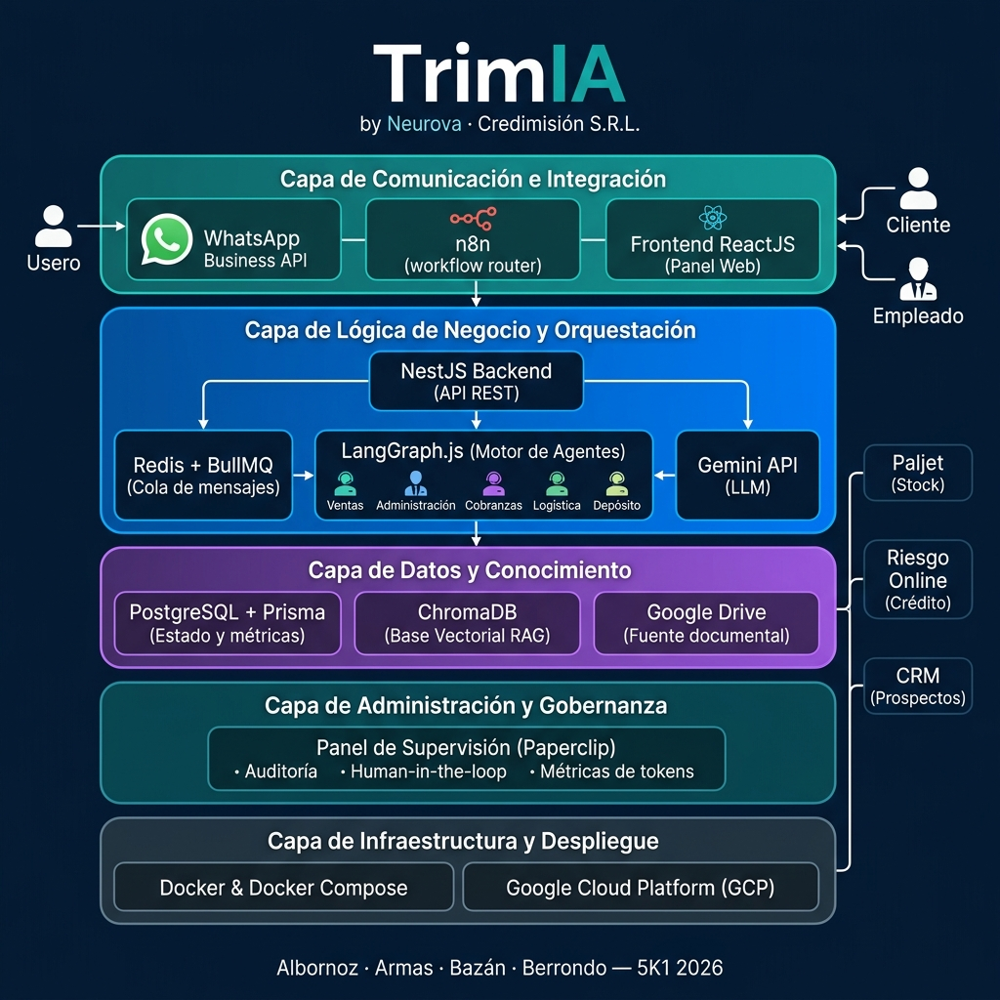

# Arquitectura de la Solución y Escalabilidad del Producto

**TrimIA — by Neurova · Credimisión S.R.L.**

Albornoz, Silvia Melisa · Armas, Mauro Nahuel · Bazán, Agustina · Berrondo, Milagros

**5K1 — 2026**

---

## 1. Arquitectura de la Solución

### 1.1 Introducción a la sección

En esta sección el lector encontrará una descripción integral de la arquitectura que sustenta a TrimIA, la plataforma de agentes inteligentes desarrollada por Neurova para Credimisión S.R.L. El objetivo es hacer visible —tanto de forma narrativa como gráfica— cómo se organizan los actores, componentes, procesos y tecnologías que hacen posible la solución, de manera que cualquier interesado pueda comprender la idea propuesta con solo observar el diagrama y leer las descripciones que lo acompañan.

La arquitectura se presenta siguiendo un modelo de capas, donde cada nivel cumple una responsabilidad específica y se comunica con los demás a través de interfaces bien definidas. Este enfoque permite aislar responsabilidades, facilitar el mantenimiento y habilitar la escalabilidad futura del sistema.

> **Fuentes:** La información aquí presentada se consolida a partir del documento de producto (`docs/product.md`, capas del sistema), el contexto técnico (`docs/CONTEXTO_TECNICO.md`, §2-§5) y la arquitectura global definida en el TPN2 (`docs/ADGE/5K1_TPN2_...`, líneas 87-131).

---

### 1.2 Actores del Sistema

La plataforma TrimIA interactúa con tres tipos de actores claramente diferenciados:

| Actor                       | Rol                                                                                                                                                                                      | Canal de acceso                             |
| --------------------------- | ---------------------------------------------------------------------------------------------------------------------------------------------------------------------------------------- | ------------------------------------------- |
| **Cliente Final**           | Realiza compras y consultas comerciales. Interactúa con los agentes de ventas y cobranzas a través de mensajería.                                                                        | WhatsApp Business API                       |
| **Empleado de Credimisión** | Utiliza el sistema para atender clientes, capacitarse y resolver dudas operativas internas. Accede tanto al canal conversacional como al panel web.                                      | WhatsApp Business API / Panel Web (ReactJS) |
| **Supervisor / Gerente**    | Audita el comportamiento de los agentes, resuelve consultas escaladas que el sistema no puede atender autónomamente, gestiona la base de conocimiento y monitorea métricas de operación. | Panel Web (Paperclip)                       |

> **Fuente:** TPN2, líneas 91-94 y `docs/product.md`, líneas 46-67.

---

### 1.3 Diseño de la Arquitectura — Representación Gráfica

A continuación se presenta el diagrama de arquitectura global de TrimIA. El diseño sigue un modelo de cinco capas que refleja la separación de responsabilidades de la plataforma:

---

### 1.4 Descripción de las Capas y Componentes

#### Capa 1 — Comunicación e Integración (Las Fronteras)

Esta capa gestiona la entrada y salida de información hacia el mundo exterior. Es el punto de contacto entre los usuarios y la inteligencia del sistema.

- **WhatsApp Business API:** Canal oficial y principal donde clientes y empleados interactúan con los agentes. Los mensajes ingresan al sistema a través de webhooks y las respuestas se entregan al usuario en el mismo canal.
- **n8n (Enrutador de flujos):** Plataforma de automatización que recibe los webhooks de WhatsApp, extrae la información relevante (número de teléfono, texto del mensaje) y la envía al backend NestJS. También recibe la respuesta del backend y la formatea para su reenvío a WhatsApp.
- **Frontend ReactJS (Panel Web):** Interfaz de acceso exclusivo para empleados y supervisores. Desde aquí se accede a los módulos de capacitación, gestión de conocimiento, cola de revisiones y supervisión de agentes.

> **Fuente:** `docs/product.md`, líneas 46-50; `docs/CONTEXTO_TECNICO.md`, §3 (Flujo de un mensaje).

#### Capa 2 — Lógica de Negocio y Orquestación (El Cerebro)

Núcleo del sistema donde reside la inteligencia y el control de concurrencia. Aquí se toman las decisiones sobre qué agente debe atender cada consulta.

- **NestJS (TypeScript):** Framework del backend que proporciona una arquitectura modular con inyección de dependencias. Expone la API REST que conecta todos los componentes.
- **Redis + BullMQ:** Sistema de colas de mensajes. Recibe los mensajes entrantes de n8n instantáneamente para evitar saturar el servidor, permitiendo procesar las respuestas de la IA en segundo plano sin perder el hilo conversacional.
- **LangGraph.js & LangChain.js:** Motor de razonamiento que implementa el _Agente Orquestador_ y los cinco subagentes especializados mediante grafos de estado cíclicos. Utiliza una estrategia de enrutamiento _sticky_ (adhesivo): una vez asignada una conversación a un agente, se mantiene en él hasta que el tema se resuelva o se necesite una derivación explícita.
- **Gemini API (Google AI Studio):** Modelo de Lenguaje Grande (LLM) que dota de capacidad generativa, análisis de intención y persuasión a los agentes.

**Los cinco agentes especializados son:**

| Agente             | Función                                                                               |
| ------------------ | ------------------------------------------------------------------------------------- |
| **Ventas**         | Asesora sobre productos y realiza seguimiento comercial persistente.                  |
| **Administración** | Verifica condiciones crediticias y autoriza financiaciones consultando Riesgo Online. |
| **Cobranzas**      | Gestiona recordatorios de pago y seguimiento de cuentas corrientes.                   |
| **Logística**      | Informa estados de despacho y fechas de entrega.                                      |
| **Depósito**       | Informa disponibilidad de stock en tiempo real.                                       |

> **Fuente:** `docs/product.md`, líneas 52-57; `docs/CONTEXTO_TECNICO.md`, §4 (Los 5 agentes); TPN2, líneas 96-101.

#### Capa 3 — Datos y Conocimiento (La Memoria)

Donde el sistema busca el contexto corporativo y almacena el historial de las interacciones.

- **PostgreSQL (con Prisma ORM):** Base de datos relacional que almacena el estado de las conversaciones (memoria a largo plazo de LangGraph), métricas de uso y registros transaccionales del bot.
- **ChromaDB:** Base de datos vectorial que aloja los embeddings de los manuales, catálogos y protocolos internos de Credimisión para ejecutar la arquitectura RAG (Generación Aumentada por Recuperación), asegurando respuestas basadas en información oficial y evitando alucinaciones.
- **Sistemas Externos (solo lectura):** Paljet (stock y saldos), Riesgo Online (verificación crediticia) y CRM (prospectos y seguimiento) son consultados por los agentes mediante herramientas (_Tools_) sin modificar datos en esos sistemas.

> **Fuente:** `docs/product.md`, líneas 59-63; `docs/CONTEXTO_TECNICO.md`, §5 (RAG).

#### Capa 4 — Administración y Gobernanza (El Panel de Control)

Interfaz humana para auditar, controlar y supervisar la operación de los agentes.

- **Paperclip (Panel de Supervisión):** Entorno visual para supervisores que permite monitorear el gasto de tokens, leer el historial exacto de derivaciones de LangGraph, pausar agentes o tomar el control manual del chat (_Human-in-the-loop_) en casos críticos. Incluye la bandeja de revisiones donde llegan las consultas que los agentes derivaron por no poder resolverlas autónomamente.

> **Fuente:** `docs/product.md`, líneas 65-67; TPN2, líneas 103-105.

#### Capa 5 — Infraestructura y Despliegue (Los Cimientos)

Entorno físico y virtual donde se ejecuta toda la solución.

- **Docker & Docker Compose:** Contenedores que empaquetan NestJS, Redis, ChromaDB y n8n, asegurando que funcionen idénticamente en desarrollo y en producción.
- **Google Cloud Platform (GCP):** Proveedor de infraestructura en la nube (Cloud Run, Cloud SQL, Memorystore) donde se alojan los contenedores para garantizar alta disponibilidad operativa.

> **Fuente:** `docs/product.md`, líneas 69-72; `docs/CONTEXTO_TECNICO.md`, §2.

---

### 1.5 Pila Tecnológica

En esta sección se describen y justifican las tecnologías, herramientas y tendencias seleccionadas para materializar la solución. La elección de cada componente responde a criterios de eficiencia operativa, costo, escalabilidad y alineación con el ecosistema de Google Cloud.

| Tecnología                        | Categoría                     | Justificación                                                                                                                                                                                                                      |
| --------------------------------- | ----------------------------- | ---------------------------------------------------------------------------------------------------------------------------------------------------------------------------------------------------------------------------------- |
| **NestJS (TypeScript)**           | Backend / API                 | Framework modular con inyección de dependencias nativa, ideal para una arquitectura orientada a servicios. TypeScript aporta tipado estático que reduce errores en tiempo de desarrollo y facilita el mantenimiento a largo plazo. |
| **LangGraph.js + LangChain.js**   | Motor de Agentes IA           | Permite modelar la lógica de los agentes como grafos de estado cíclicos, habilitando flujos de conversación complejos con memoria y herramientas. Es el estándar de facto para orquestación de agentes con LLMs.                   |
| **Gemini API (Google AI Studio)** | Modelo de Lenguaje (LLM)      | Ofrece capacidad generativa de alto nivel con costos competitivos. Al pertenecer al ecosistema de Google, se integra de forma nativa con GCP y reduce la fricción operativa.                                                       |
| **n8n**                           | Automatización de Flujos      | Plataforma open-source de automatización que actúa como enrutador entre WhatsApp y el backend. Permite modificar flujos de integración sin requerir cambios en el código del backend.                                              |
| **Redis + BullMQ**                | Cola de Mensajes              | Garantiza el procesamiento asincrónico de mensajes, desacoplando la recepción de la respuesta. Evita la saturación del servidor durante picos de demanda y asegura que ningún mensaje se pierda.                                   |
| **PostgreSQL + Prisma ORM**       | Base de Datos Relacional      | Motor relacional robusto y gratuito. Prisma proporciona un ORM con migraciones tipadas, alineado con TypeScript, que simplifica la gestión del modelo de datos.                                                                    |
| **ChromaDB**                      | Base de Datos Vectorial (RAG) | Almacena embeddings de los documentos corporativos para consultas semánticas. Solución ligera y open-source que se despliega como contenedor Docker junto al backend.                                                              |
| **ReactJS**                       | Frontend Web                  | Biblioteca de interfaces declarativa con amplio ecosistema. Permite construir el panel de supervisión y el módulo de capacitación con componentes reutilizables.                                                                   |
| **WhatsApp Business API**         | Canal de Comunicación         | Canal donde ya ocurre la comunicación operativa de Credimisión. Adoptar la API oficial de Meta garantiza cumplimiento normativo y acceso a funciones avanzadas de mensajería.                                                      |
| **Docker & Docker Compose**       | Contenedorización             | Empaqueta cada servicio en un contenedor aislado, asegurando paridad entre entornos de desarrollo y producción. Simplifica despliegues y rollbacks.                                                                                |
| **Google Cloud Platform (GCP)**   | Infraestructura en la Nube    | Proveedor elegido por su integración nativa con Gemini y sus servicios gestionados (Cloud Run, Cloud SQL, Memorystore). Ofrece un modelo de pago por uso que optimiza costos para una startup.                                     |

> **Fuente:** `docs/CONTEXTO_TECNICO.md`, §2 (Stack técnico); `docs/product.md`, líneas 44-72; TPN2, líneas 151-158.

---
