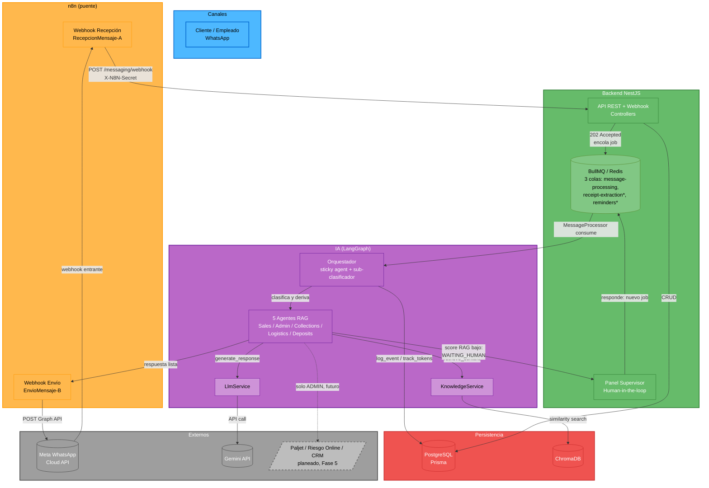
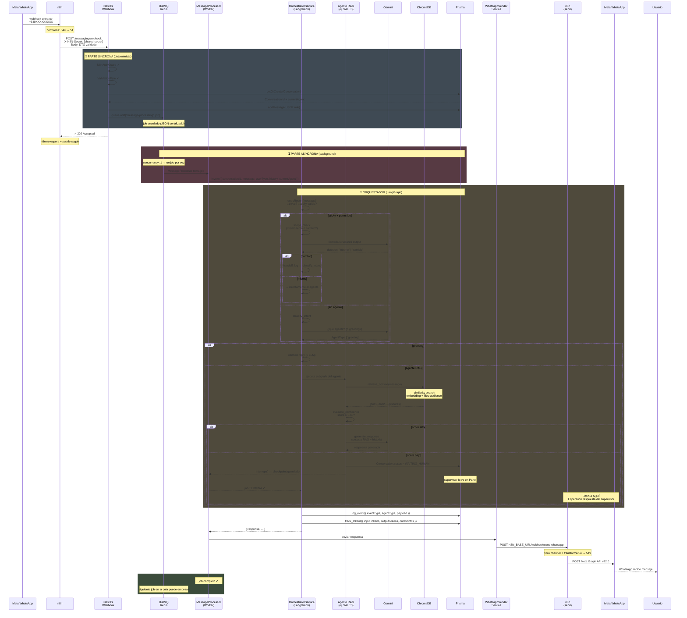
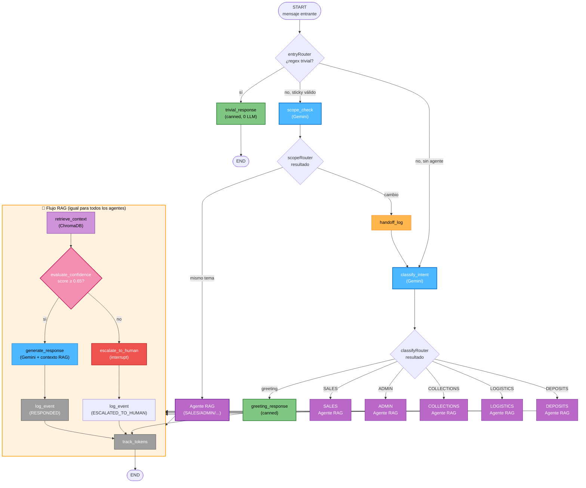
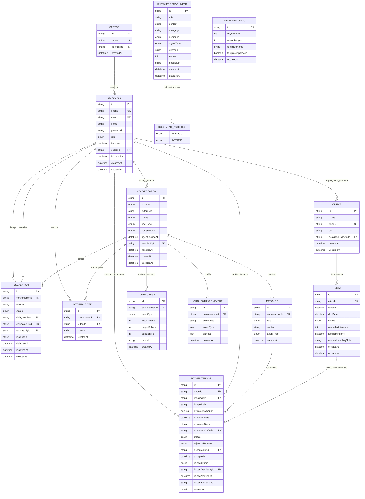

# Diagramas de Arquitectura — TrimIA

## 0. Arquitectura General del Sistema

> Mapa de alto nivel: qué componente habla con cuál y por qué medio. Sirve como punto de entrada antes de los diagramas de detalle (secciones 1-5). Refleja el estado de Sprints 1-3 (revisados en code-review) más la incorporación de Cobranzas (Sprint 4, `sprint-4-cobranzas`, en curso — nodos marcados abajo). Los sistemas externos Paljet/Riesgo Online/CRM están **planeados para Fase 5** (`src/ai/agents/admin/admin.graph.ts` solo los menciona en un comentario, no hay cliente HTTP implementado todavía) — se muestran con línea punteada para no sugerir que ya existen.



*Colas `receipt-extraction` y `reminders`: agregadas en Sprint 4 (Cobranzas) para procesar comprobantes de pago recibidos por WhatsApp y disparar recordatorios de cuotas — todavía no pasaron por code-review de equipo.

**Supuestos tomados:** el envío de respuesta (`WhatsappSenderService`) se representa como una flecha directa `agents → n8n_out` porque en el código real ese paso ocurre después de que el orquestador arma la respuesta final, no dentro del subgrafo de cada agente — simplificado acá para no agregar un nodo extra de bajo valor explicativo.

---

## 1. El viaje de un mensaje — Secuencia Simplificada

> Desde que Meta entrega un mensaje hasta que vuelve al usuario. Muestra por qué es asíncrono (202 Accepted inmediato), cómo BullMQ evita condiciones de carrera (concurrency: 1), y qué pasa cuando el score RAG es bajo (escalada a humano = job termina, supervisor reanuda con job nuevo). Refleja estado actual del código: scope_check en Gemini, retrieve_context en ChromaDB, evaluate_confidence con threshold 0.65.

Para ver un sequence diagram interactivo, abrí [este archivo en Mermaid Live](https://mermaid.live/) y pegá el código de abajo:



**Flujo resumido:**
1. **Síncrono (202 inmediato)**: webhook → validar → crear Conversation → encolar job → responder
2. **Asíncrono (background)**: worker → orquestador → agente RAG → evaluate_confidence
   - Si score ≥ 0.65: genera respuesta con Gemini
   - Si score < 0.65: pausa (escalada a humano)
3. **Respuesta**: envía por WhatsApp → n8n → Meta

**Por qué concurrency: 1:**
- Si dos mensajes del mismo usuario llegan rápido, el segundo espera en la cola
- Evita que dos workers lean y pisen el mismo checkpoint de LangGraph
- Garantiza que escaladas no se duplican

**Decisiones de diseño visibles en este flujo:**
- **202 Accepted inmediato**: webhook no espera a Gemini — n8n no sufre timeout
- **concurrency: 1**: un job por vez. Evita race conditions en checkpoints de LangGraph
- **Dos fases**: síncrona (webhook → validar → encolar) y asíncrona (worker → orquestador → respuesta)
- **Escalada termina job**: no cuelga esperando supervisor. Supervisor reanuda con **nuevo job** después
- **ChromaDB solo busca**: `retrieve_context` es O(log n), `evaluate_confidence` es puro filtro (0 tokens)

---

## 2. Flujo de un Mensaje (entrada → salida) — Detalle ASCII

```
                      Meta WhatsApp
                           │
                           │ (recibe 549XXXXXXXXX)
                           ▼
           ┌───────────────────────────────────┐
           │   n8n Webhook (RecepcionMensaje-A)│
           │   Normaliza: 549 → 54             │
           └──────────────┬────────────────────┘
                          │
                          ▼
           ┌──────────────────────────────────┐
           │ NestJS POST /messaging/webhook    │
           │  • Guard: x-n8n-secret           │
           │  • ValidationPipe: DTO           │
           │  • responde 202 (ACEPTADO)       │
           └────────┬─────────────────────────┘
                    │
         ┌──────────▼──────────┐
         │  MessagingService   │
         │  1. getOrCreate()   │ ← memoria conversacional
         │  2. addMessage()    │
         │  3. queue.add()     │ (BullMQ con retry)
         └────────┬────────────┘
                  │
                  ▼ (job en cola)
    ┌──────────────────────────────────┐
    │  MessageProcessor (worker)        │
    │  consume jobs + invoke orchestrator
    └────────┬─────────────────────────┘
             │
             ▼
    ┌──────────────────────────────────┐
    │ orchestrator.invoke()             │
    │ OrchestratorState = {             │
    │   input,                          │
    │   userId,                         │
    │   userType (CLIENTE/EMPLEADO),   │
    │   history (últimas 6 vueltas),   │ ← memoria
    │   currentAgent                    │
    │ }                                 │
    └────────┬─────────────────────────┘
             │
    ┌────────▼─────────────────────────────────┐
    │ [Nodo 1] classify_intent()                │
    │ ¿Es un saludo? (regex) → skip tokens     │
    └────────┬─────────────────────────────────┘
             │
             ▼
    ┌────────────────────────────────────────┐
    │ [Nodo 2] scope_check()                  │
    │ ¿userType está permitido en este token?│
    └────────┬────────────────────────────────┘
             │
             ▼
    ┌────────────────────────────────────────┐
    │ [Nodo 3] sticky_agent()                 │
    │ ¿ya tiene agente? (Conversation.currAg)│
    │ Si no → ruta a SALES/COLLECTIONS       │
    └────────┬────────────────────────────────┘
             │
             ▼
    ┌────────────────────────────────────────────────────┐
    │ [Nodo 4] Agente RAG (ej. SALES)                   │
    │                                                     │
    │ 1. retrieve_context()                             │
    │    ChromaDB.query(input, audience=PUBLICO, k=4)  │
    │                                                     │
    │ 2. evaluate_confidence()                          │
    │    score >= 0.65? → generate : escalate          │
    │                                                     │
    │ 3a. generate_response() [si score >= 0.65]       │
    │     Gemini + context + history → respuesta       │
    │                                                     │
    │ 3b. escalate_to_human() [si score < 0.65]        │
    │     status=WAITING_HUMAN → espera supervisor     │
    └────────┬────────────────────────────────────────────┘
             │
             ▼
    ┌────────────────────────────────────────┐
    │ OrchestrationLogger.track()             │
    │ ├─ OrchestrationEvent (qué pasó)       │
    │ └─ TokenUsage (input/output tokens)    │
    └────────┬────────────────────────────────┘
             │
             ▼
    ┌────────────────────────────────────────┐
    │ Message.addMessage() → DB              │
    │ Conversation.setCurrentAgent()         │
    └────────┬────────────────────────────────┘
             │
             ▼
    ┌────────────────────────────────────────┐
    │ WhatsappSenderService.send()           │
    │ POST N8N_BASE_URL/webhook/send-whatsapp│
    └────────┬────────────────────────────────┘
             │
             ▼
    ┌────────────────────────────────────────┐
    │ n8n Workflow (EnvioMensaje-B)          │
    │ 1. Filtro: channel == WHATSAPP?        │
    │ 2. Transform: 54 → 549 (Meta expect.)  │
    │ 3. POST Meta Graph API v22.0           │
    └────────┬────────────────────────────────┘
             │
             ▼
         Meta WhatsApp
      (envía 549XXXXXXXXX)
```

---

## 2. Orquestación y Ruteo de Agentes — Flowchart (Mermaid)

> El "cerebro" del sistema: cómo LangGraph decide qué agente atiende cada mensaje. Muestra el flujo sticky agent, sub-clasificador de scope (Gemini), la cascada de 5 agentes RAG con patrón interno unificado, y el gate de confianza (threshold 0.65). Refleja lo que está en `src/ai/orchestrator/orchestrator.graph.ts` + `src/ai/agents/shared/rag-agent.graph.ts`.



**Flujos destacados:**

1. **Saludos triviales** (regex exacto): canned reply de 0 tokens, fin inmediato
2. **Sticky agent + mismo tema**: salta `classify_intent`, va directo al agente (optimización de latencia)
3. **Sticky + cambio de tema**: escala a `classify_intent`, que reclasifica
4. **Sin agente o permitido rechazado**: `classify_intent` con Gemini, detecta greetings inteligentes
5. **Patrón RAG unificado** (todos los agentes): retrieve → evaluate_confidence → generate/escalate
   - `retrieve_context`: ChromaDB filtra por audience (`PUBLICO` si CLIENTE, `PUBLICO+INTERNO` si EMPLEADO)
   - `evaluate_confidence`: threshold 0.65 vs. mejor score
   - `generate_response`: Gemini con prompt específico del agente (rol, personalidad, instrucciones)
   - `escalate_to_human`: si score < 0.65, `interrupt()` → checkpoint guardado → supervisor lo ve en Panel

**Confidencialidad integrada:**
- `allowedAgentsFor(userType)` en `entryRouter` y `classify_intent`: CLIENTE solo ve SALES/COLLECTIONS; EMPLEADO ve todos
- Filtro de audience en `retrieve_context` (ChromaDB `where_filter`): nunca un CLIENTE recupera docs INTERNO

---

## 3. Grafo — Detalle ASCII
```
                              ┌─────────┐
                              │  START  │
                              └────┬────┘
                                   │
                          entryRouter()   
                                   │
                                   │
              ┌────────────────────┼───────────────────────┐
              │                    │                       │ 
     trivial  │              sticky│            orchestrate│
   (regex hola/    (currentAgent ya                    (sin agente o
    gracias/etc.)   fijado y permitido)                 no permitido)
              │                    │                       │
              ▼                    ▼                       │
     ┌─────────────────┐   ┌───────────────┐               │
     │ trivial_response│   │  scope_check  │               │
     │  (canned, 0 LLM)│   │ (Gemini: ¿es  │               │
     └────────┬────────┘   │  del tema? +  │               │
              │            │  ¿greeting?)  │               │
              │            └───────┬───────┘               │
              │                    │                       │ 
              │             scopeRouter()                  │ 
              │                    │                       │      
              │        ┌───────────┼────────────┐          │
              │  mismo +│      mismo,│      cambio│         │
              │ greeting│  no greeting│           │         │
              │        ▼           ▼            ▼          │
              │        │   (agente actual) ┌────────────┐  │
              │        │           │        │ handoff_log│  │
              │        │           │        │ (Prisma)   │  │
              │        │           │        └─────┬──────┘  │
              │        │           │              │         │
              │        │           │              ▼         ▼
              │        │           │        ┌───────────────────────────┐
              │        │           │        │     classify_intent       │
              │        │           │        │ (Gemini structured output;│
              │        │           │        │  solo agentes permitidos) │
              │        │           │        └─────────────┬─────────────┘
              │        │           │                      │    
              │        │           │           classifyRouter()
              │        │           │                      │
              │        │           │          ┌───────────┴───────────┐
              │        │           │  greeting│                 agente│
              │        │           │          ▼                       │
              │        │           │   ┌──────────────────┐           │
              │        └───────────┼──▶│ greeting_response│           │
              │                    │   │   (canned)       │           │
              │                    │   └────────┬─────────┘           │
              │                    │            │                     │
              │             ┌──────────────────┘                      │
              │             │      │                                  │       
              │             │      ▼                                  ▼
              │             │   ┌────────────────────────────────────────────────────┐
              │             │   │   AGENTE RAG  (SALES│ADMIN│COLLECTIONS│LOGI│DEPO)  │
              │             │   │   1. retrieve_context  (ChromaDB, audiencia/role)  │
              │             │   │   2. evaluate_confidence  (score ≥ 0.65?)          │
              │             │   │   3a. generate_response (Gemini+contexto+historial)│
              │             │   │   3b. escalate_to_human (status=WAITING_HUMAN)     │
              │             │   └────────────────────────┬───────────────────────────┘
              │             │                            ▼
              │             │                     ┌──────────────┐
              │             │                     │  log_event   │  (OrchestrationEvent → Prisma)
              │             │                     └──────┬───────┘
              │             │                            │
              │             │       ┌────────────────────┘
              │             ▼       ▼
              │            ┌──────────────┐
              │            │ track_tokens │  (TokenUsage → Prisma)
              │            └──────┬───────┘
              │                   │
              ▼                   ▼
           ┌─────────────────┐
           │       END       │
           └─────────────────┘

Notas:
• trivial_response va DIRECTO a END (no pasa por track_tokens: gastó 0 tokens).
• greeting_response → track_tokens → END (el orquestador sí consumió tokens al clasificar).
• Los routers (entryRouter, scopeRouter, classifyRouter) son funciones puras: deciden el
  camino SIN llamar a Gemini. Solo classify_intent, scope_check y los agentes gastan tokens.
• FIX (2026-08-04): scope_check devuelve isGreeting en la MISMA llamada estructurada que
  ya hacía para decidir mismo/cambio (scopeSchema, sin costo extra de tokens). Antes, la
  rama "mismo" iba directo al agente sticky sin evaluar greeting — un mensaje sticky que
  fuera mayormente un saludo/cortesía ("buenísimo, gracias! ¿y la cuota 3?") gastaba un
  turno completo de RAG en vez de resolverse como greeting_response, a diferencia de la
  rama classify_intent que sí lo detectaba. scopeRouter ahora chequea isGreeting antes de
  resolver al agente, igual que classifyRouter.

```

---

## 4. RAG y Confidencialidad

```
┌─────────────────────────────────────────────────────────────────────┐
│                    ChromaDB (vector database)                       │
│                                                                     │
│  Documentos cargados con metadatos:                                │
│  ┌──────────────────────────────────────────────────────────────┐  │
│  │ Doc ID | Texto | Embedding | audience | agentType | titulo   │  │
│  ├──────────────────────────────────────────────────────────────┤  │
│  │ uuid-1 | "cómo pago..." | [0.1, 0.2, ...] | PUBLICO | SALES  │  │
│  │ uuid-2 | "ingresos requeridos" | [0.15, 0.25, ...] | INTERNO│  │
│  │        |                |           | ADMIN     │            │  │
│  │ uuid-3 | "política crediticia" | [...] | INTERNO | ADMIN    │  │
│  │ uuid-4 | "horario de atención" | [...] | PUBLICO | GENERAL  │  │
│  └──────────────────────────────────────────────────────────────┘  │
└─────────────────────────────────────────────────────────────────────┘
     ▲
     │ (3) ChromaDB.query(
     │     embedding,
     │     where_filter={
     │       audience: "PUBLICO" (si CLIENTE)
     │     },
     │     k=4
     │   )
     │
     │ (2) input embedido
     │     text-embedding-004
     │
     │ (1) usuario CLIENTE entra a SALES
     │
┌────┴────────────────────────────────────────────────────────────────┐
│                   Filtro de Confidencialidad                        │
│                                                                     │
│  En rag-agent.graph.ts:                                            │
│  ├─ Si userType == 'CLIENTE':                                      │
│  │  └─ Recuperar solo docs con audience='PUBLICO'                 │
│  │     (nunca ve 'INTERNO')                                        │
│  │                                                                 │
│  ├─ Si userType == 'EMPLEADO':                                    │
│  │  └─ Recuperar docs con audience='PUBLICO' + 'INTERNO'          │
│  │     (ve todo, según agente permitido)                          │
│  │                                                                 │
│  └─ allowedAgentsFor(userType) en agent-domains.ts:              │
│     ├─ CLIENTE → [SALES, COLLECTIONS]                           │
│     └─ EMPLEADO → [SALES, ADMIN, COLLECTIONS, LOGISTICS, DEPOSITS]
│                                                                     │
│  Regla de oro: un cliente NUNCA recupera docs INTERNO.            │
│  Esta regla NO se puede romper sin permisos del usuario.          │
└─────────────────────────────────────────────────────────────────────┘
```

---

## 5. Agentes RAG — Patrón Común

```
Cada agente (SALES, ADMIN, COLLECTIONS, LOGISTICS, DEPOSITS) sigue
el mismo patrón, definido en: src/ai/agents/shared/rag-agent.graph.ts

┌────────────────────────────────────────────────────────────────────┐
│  buildRagAgentGraph(config, deps)                                  │
│  ├─ config: ConfigService (modelos, thresholds)                    │
│  ├─ deps: { llm, knowledge, logger }                              │
│  └─ return: AgentGraph (LangGraph)                                 │
└────────┬───────────────────────────────────────────────────────────┘
         │
         ▼
┌────────────────────────────────────────────────────────────────────┐
│                      Nodos del Grafo                               │
│                                                                     │
│  [1] retrieve_context                                              │
│      ├─ input: estado.input                                        │
│      ├─ action: KnowledgeService.search(                          │
│      │   query=estado.input,                                      │
│      │   audience=PUBLICO|PUBLICO+INTERNO,                       │
│      │   agentType=SALES|ADMIN|...                               │
│      │   k=4                                                       │
│      │ )                                                            │
│      ├─ output: estado.context = [doc1, doc2, ...]               │
│      └─ costo: 0 tokens (solo busca de vector)                    │
│                                                                     │
│  [2] evaluate_confidence                                           │
│      ├─ input: estado.context[]                                    │
│      ├─ logic: Si context.length > 0 && context[0].score >= 0.65  │
│      │          → alta confianza → generate_response              │
│      │          senó → escalate_to_human                          │
│      ├─ umbral: RAG_CONFIDENCE_THRESHOLD = 0.65 (observable)     │
│      └─ costo: 0 tokens (puro filtro)                             │
│                                                                     │
│  [3a] generate_response (si contexto confiable)                    │
│      ├─ input: estado.context, estado.input, estado.history      │
│      ├─ prompt: <agente>.prompt.ts                                │
│      │   (rol, personalidad, instrucciones de SALES/ADMIN/...)    │
│      ├─ action: LlmService.generate(                              │
│      │   messages=system+history+user,                            │
│      │   model=gemini-3.1-flash-lite,                            │
│      │   temperature=0.7,                                         │
│      │   maxTokens=512                                            │
│      │ )                                                            │
│      └─ output: estado.response                                    │
│                                                                     │
│  [3b] escalate_to_human (si contexto débil)                       │
│      ├─ output: estado.response = "Un supervisor revisará pronto" │
│      ├─ acción: Conversation.status = WAITING_HUMAN              │
│      └─ efecto: supervisor lo ve en Panel (Cola de Prioridades)   │
│                                                                     │
│  [4] track_tokens                                                  │
│      ├─ input: tokens gastados en [3a] o [3b]                     │
│      └─ action: TokenUsage.create({                               │
│           agentType, inputTokens, outputTokens,                   │
│           conversationId                                           │
│        })                                                           │
│                                                                     │
└────────────────────────────────────────────────────────────────────┘

Cada agente tiene variantes:

  SALES / COLLECTIONS
  ├─ Audiencia: CLIENTE (solo PUBLICO)
  ├─ allowedFor: CLIENTE + EMPLEADO
  └─ Escalada: SÍ (si score < umbral)

  ADMIN
  ├─ Audiencia: EMPLEADO (PUBLICO + INTERNO)
  ├─ allowedFor: solo EMPLEADO
  ├─ Acceso especial: Riesgo Online API
  └─ Escalada: SÍ

  LOGISTICS / DEPOSITS
  ├─ Audiencia: EMPLEADO (PUBLICO + INTERNO)
  ├─ allowedFor: solo EMPLEADO
  └─ Escalada: NO (sin herramientas, solo RAG)
```
## 4. Modelo de Datos — ER Diagram (Mermaid)

> Esquema de Prisma (PostgreSQL). Agrupa las entidades en subsistemas: conversaciones/mensajes/auditoría (el core), empleados/acceso (control), cobranzas (Sprint 4), y RAG/conocimiento. Omite las tablas de LangGraph checkpointer (viven en PostgreSQL pero sin gestión Prisma) y ChromaDB vectorial (otra DB, no relacional). Fuente: `prisma/schema.prisma`.



**Subsistemas destacados:**

1. **Conversaciones y Auditoría (core)**: Conversation → Message, OrchestrationEvent, TokenUsage. Todo queda registrado para análisis post-mortem y métricas del Panel
2. **Escalada a Humano**: Conversation → Escalation → Employee (delega/resuelve). Cada escalada es un caso auditado
3. **Notas Internas**: Employee escribe InternalNote sobre Conversation — nunca se envía al usuario
4. **Control Manual (Sprint 3)**: Conversation.handledById + handledAt marcan cuándo un supervisor tomó control
5. **Cobranzas (Sprint 4)**: Client → Quota (cuota de una venta financiada) → PaymentProof (comprobante enviado por WhatsApp). Employee acepta y verifica impacto
6. **Recordatorios (Sprint 4)**: ReminderConfig es una fila única editable — agenda automática en BullMQ (reminders processor)
7. **RAG y Conocimiento**: KnowledgeDocument con audience (PUBLICO/INTERNO) y agentType — ChromaDB almacena vectores, Prisma guarda metadata

**No incluidos (viven afuera o sin Prisma):**
- Checkpointer de LangGraph: tablas `checkpoints`, `checkpoint_writes`, `checkpoint_blobs` en PostgreSQL, setup automático vía `PostgresSaver`, **no gestionadas por Prisma**
- ChromaDB (vectorial): otra BD, contiene embeddings de KnowledgeDocument.content. Referencia: `vectorId` en KnowledgeDocument
- Sistemas externos (Paljet/Riesgo Online/CRM): aún no implementados, reservado Fase 5

---

## Notas Técnicas

### Gotchas (ya resueltos, NO re-debuggear)

1. **Embeddings:** `text-embedding-004` → 404. Usar `gemini-embedding-001` (dim 3072).
2. **ChromaDB 1.9.x:** No devuelve distancias por defecto. Solución: vectores precomputados + `include=['distances']`.
3. **WhatsApp Argentina:** Recibe `549XXXXXXXXX` pero envía a `54XXXXXXXXX`. Aplicado en n8n.
4. **RAG threshold:** 0.70 → 0.65 (gap observado: relevantes 0.74–0.81, irrelevantes ~0.55).
5. **Checkpointer:** Eliminado del código (PostgresSaver recreaba tablas). Se recablea Fase 5.

### Conceptos Clave

- **Sticky agent:** `Conversation.currentAgent` + `agentLockedAt` memo. Memoiza por conversación.
- **Scope check:** `allowedAgentsFor(userType)` respeta confidencialidad.
- **Audience filtrado:** ChromaDB query filtra por `audience` según `userType`.
- **Confidencialidad (OE-10):** CLIENTE NUNCA ve INTERNO, NUNCA accede a agentes no permitidos.
- **Auditoría (OE-11):** Todos los pasos en OrchestrationEvent; supervisores lo ven en el Panel.
