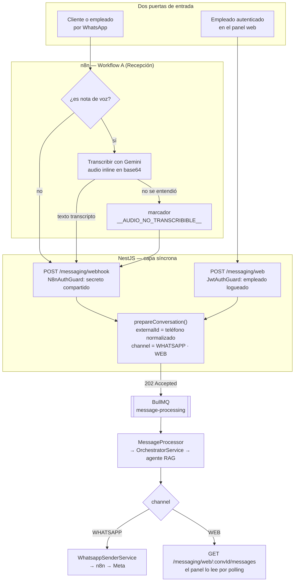
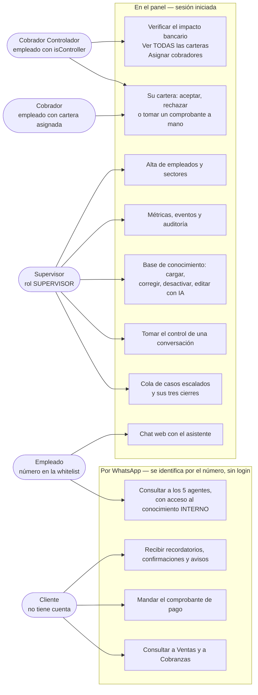
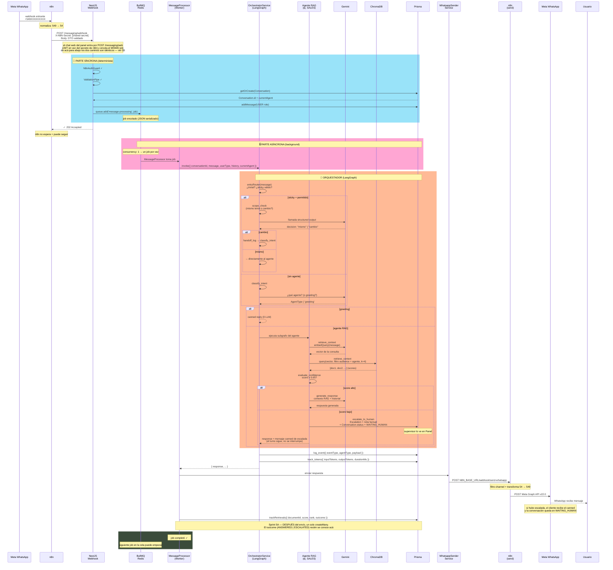
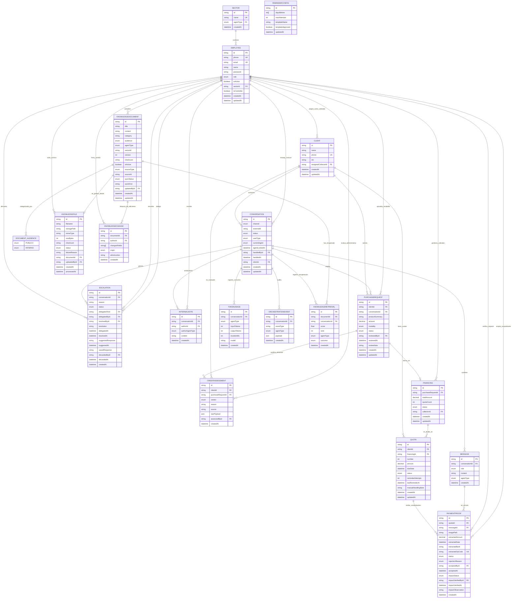

# Diagramas de Arquitectura — TrimIA

## 1. Módulos del Sistema (20 total)

TrimIA está organizado en **4 capas de módulos** según responsabilidad, no por orden alfabético. Esto hace que la arquitectura sea clara de un vistazo.

### 🔧 Infraestructura Global (@Global, sin import explícito en cada módulo)

| Módulo | Ubicación | Rol |
|--------|-----------|-----|
| **AppConfigModule** | `config.module.ts` | Carga y valida `.env` con Joi (falla rápido si falta variable requerida) |
| **PrismaModule** | `prisma.module.ts` | Cliente PostgreSQL vía Prisma (singleton global) |
| **RedisModule** | `redis.module.ts` | Cliente Redis para colas y caché |
| **LlmModule** | `llm.module.ts` | Cliente Gemini, inyectable en cualquier servicio |
| **AuthModule** | `auth.module.ts` | JWT + Passport + guards de roles (JwtAuthGuard, RoleGuard) |

### 🧠 Núcleo de IA (Agentes + RAG + Orquestación)

| Módulo | Ubicación | Rol |
|--------|-----------|-----|
| **KnowledgeModule** | `knowledge.module.ts` | Motor RAG **+ gestión del corpus** (Sprint 5A): CRUD, ingesta de archivos, edición asistida por IA e indicador de uso. Pasó de 2 archivos a 5 servicios + 4 extractores |
| **AgentsModule** | `agents.module.ts` | Lógica de los 5 agentes especializados (SALES/ADMIN/COLLECTIONS/LOGISTICS/DEPOSITS) |
| **OrchestratorModule** | `orchestrator.module.ts` | Orquesta flujo entre agentes, ruteo sticky, scope_check, classify_intent |
| **OrchestrationLoggerModule** | `orchestration-logger.module.ts` | Auditoría (OE-11): persiste OrchestrationEvent + TokenUsage (separado para evitar import cíclico) |

### 💼 Dominio de Negocio (Credimisión)

| Módulo | Ubicación | Rol |
|--------|-----------|-----|
| **ClientsModule** | `clients.module.ts` | Clientes + adaptador n8n (futuro: Paljet/CRM) |
| **SalesModule** | `sales.module.ts` | Alta de cliente, plan de cuotas, integración vendedor |
| **CollectionsModule** | `collections.module.ts` | **Sprint 4**: Cobranzas — cuotas, recordatorios, validación de comprobantes de pago |
| **EscalationsModule** | `escalations.module.ts` | Casos escalados a humano (human-in-the-loop, Sprint 3) |
| **EmployeesModule** | `employees.module.ts` | Empleados/supervisores, roles internos, autenticación |
| **SupervisorModule** | `supervisor.module.ts` | Panel del Supervisor — cola de pendientes, control manual, métricas |

### 📨 Mensajería y Colas

| Módulo | Ubicación | Rol |
|--------|-----------|-----|
| **ConversationsModule** | `conversations.module.ts` | Historial y estado de conversaciones (memoria a largo plazo) |
| **MessagingModule** | `messaging.module.ts` | **Dos** puertas de entrada: webhook de WhatsApp y chat web del panel (`messaging-web.controller.ts`, Sprint 5A). Un solo `prepareConversation()` para las dos |
| **WhatsappSenderModule** | `whatsapp-sender.module.ts` | Envío de mensajes por WhatsApp (separado para evitar ciclo con MessagingModule) |
| **WhatsappMediaModule** | `whatsapp-media.module.ts` | Descarga/persistencia de media (comprobantes, fotos). Separado por el mismo motivo |
| **QueueModule** | `queue.module.ts` | Workers BullMQ: **5** procesadores — message-processing, receipt-extraction, reminders + **knowledge-ingestion** y **knowledge-reindex** (Sprint 5A) |

---


## 2. Canales de Acceso

> El chat web no es un pipeline nuevo. Cambia el guard de entrada y a dónde va la respuesta; el medio —conversación, cola, orquestador, agentes, auditoría— es literalmente el mismo código.



- **La identidad de una conversación web es el teléfono del empleado**, no su `id`, difiere `channel` pero la vista unificada del panel es un `findMany({ where: { externalId } })` sin ninguna tabla de correlación, y `MessageProcessor` resuelve el `userType` sin enterarse del origen del mensaje.
- **Audio de WhatsApp:** la transcripción vive **en n8n**, no en el backend (nodos `Es audio?` → `Transcribir audio (Gemini)` de `RecepcionMensaje-A.json`; el plan lo llamaba "Workflow 7", la implementación quedó en el workflow Si falla, n8n manda `__AUDIO_NO_TRANSCRIBIBLE__` y `entryRouter` lo desvía a `trivial` **aun con agente sticky** 


## 3. Actores y capacidades — quién usa el sistema y por dónde entra

> Los roles de este diagrama son los del proceso real de Credimisión; lo que no se puede deducir del dominio es **por qué puerta entra cada uno** y qué habilita esa puerta. Hay tres, con tres formas distintas de identificar a la persona: WhatsApp (sin cuenta, se reconoce por el número), chat web (sesión iniciada) y panel (sesión + permisos).



**Las cuatro cosas que este diagrama contesta y el dominio no:**

1. **El cliente nunca se registra.** Se lo reconoce por el número de teléfono, y ese mismo número decide qué agentes puede consultar y qué conocimiento le llega. Si el número está en la whitelist de empleados, la conversación pasa a valer como interna —los 5 agentes y el conocimiento `INTERNO`—; si no, quedan Ventas y Cobranzas con conocimiento `PUBLICO`. Es **una sola** regla, en `allowedAgentsFor` + el filtro de audiencia, y se re-evalúa en cada mensaje: dar de baja a un empleado le corta el acceso interno en el mensaje siguiente, sin ningún paso manual.
2. **"Cobrador Controlador" no es un rol del sistema.** Los roles son dos: `EMPLEADO` y `SUPERVISOR`. El controlador es un empleado de Cobranzas con un permiso adicional (`isController`) que hace dos cosas: le deja ver **todas** las carteras en vez de la propia, y lo habilita a la verificación de impacto bancario. Se modeló así, y no como un tercer rol, porque en la empresa es una atribución que se suma al puesto de cobrador, no un puesto distinto.
3. **Un cobrador solo ve sus clientes.** El alcance no se declara en el endpoint: se resuelve por cliente, comparando el cobrador asignado contra quien pide. Sin `isController`, un comprobante de otra cartera da `403`.
4. **El sector viaja en la sesión pero hoy no autoriza nada.** Aparece en el token y sirve para mostrar y para consultas, pero ningún endpoint decide por él: los tres controles efectivos son **rol**, **`isController`** y **cobrador asignado**. Vale saberlo antes de prometer en una demo que "cada sector ve lo suyo" — eso todavía es organizativo, no un permiso.

Un matiz que suele confundir: **un empleado tiene dos conversaciones distintas con el asistente**, la de WhatsApp y la del chat web, y son hilos separados a propósito. El panel las muestra juntas en una línea de tiempo unificada, pero cada una mantiene su propio contexto (§5).

---


## 4. El viaje de un mensaje — Secuencia Simplificada

> Desde que Meta entrega un mensaje hasta que vuelve al usuario. 



**Flujo resumido:**
1. **Síncrono (202 inmediato)**: webhook → validar → crear Conversation → encolar job → responder
2. **Asíncrono (background)**: worker → orquestador → agente RAG → evaluate_confidence
   - Si score ≥ 0.65: genera respuesta con Gemini
   - Si score < 0.65: escala a humano (`WAITING_HUMAN`) y responde el mensaje canned
3. **Respuesta**: envía por WhatsApp → n8n → Meta

**Por qué concurrency: 1:**
- Si dos mensajes del mismo usuario llegan rápido, el segundo espera en la cola
- Evita que dos workers lean y pisen el mismo checkpoint de LangGraph
- Garantiza que escaladas no se duplican

**Decisiones de diseño visibles en este flujo:**
- **202 Accepted inmediato**: webhook no espera a Gemini — n8n no sufre timeout
- **concurrency: 1**: un job por vez. Evita race conditions en checkpoints de LangGraph
- **Dos fases**: síncrona (webhook → validar → encolar) y asíncrona (worker → orquestador → respuesta)
- **La escalada no corta el turno**: `escalate_to_human` escribe la `Escalation`, deja la conversación en `WAITING_HUMAN` y **igual devuelve un mensaje al cliente**; el job pasa por `log_event` + `track_tokens` y completa normal. Lo que queda en pausa es la conversación, no el worker (el checkpointer de LangGraph está desconectado — no hay `interrupt()`)
- **`retrieve_context` toca Gemini además de ChromaDB**: la búsqueda vectorial necesita primero el embedding de la consulta (`embeddings.embedQuery`) — no es gratis, aunque no genere texto. `evaluate_confidence`, en cambio, es puro filtro (0 tokens, 0 red)
- **`classifierChat` a temperature 0** para `classify_intent` y `scope_check`: son decisiones de ruteo, no generación — necesitan ser estables (mismo mensaje → mismo agente en cada corrida). Los agentes RAG siguen generando con `llm.chat` a 0.7.
- **Atajo trivial solo sin sticky**: con un agente ya fijado, un "dale"/"ok" corto puede ser la confirmación a una pregunta que el bot mismo hizo (no una cortesía suelta) — el regex no distingue eso, así que con sticky siempre pasa por `scope_check`, que sí tiene el historial.
- **`scope_check` puede resolver `targetAgent` en la misma llamada**: si el usuario cambia de tema, el propio `scope_check` ya dice a qué agente corresponde, evitando una segunda llamada a `classify_intent`. Si no lo resuelve (o es ambiguo), `classify_intent` actúa de red de seguridad.
- **`trivial_response` ahora pasa por `log_event` + `track_tokens`**: antes iba directo a `END` y no dejaba ningún rastro en `OrchestrationEvent`/`TokenUsage`, invisible para la auditoría (OE-11).
- **El turno deja un tercer rastro: `KnowledgeRetrieval`** (Sprint 5A): qué documentos salieron candidatos, con qué score, en qué posición del top-k y **en qué terminó el turno**. Se escribe después del `send()` y un fallo ahí no reintenta el job — la respuesta ya salió, esto es telemetría (§9).

---


## 5. Modelo de Datos — ER Diagram (Mermaid)


---


## 6. Grafo del orquestador

```
                              ┌─────────┐
                              │  START  │
                              └────┬────┘
                                   │
                          entryRouter()   (función pura: 0 LLM, 0 red)
                                   │
                                   ▼
            ┌──────────────────────┬──────────────────┐
            │  isUntranscribableAudio(message)        │
            │ aviso de n8n: no hay texto del usuario  │
            └───────┬─────────────────────────┬───────┘
                SÍ  │                         │ NO
                    │                         ▼
                    │         ┌───────────────┬───────────────────────┐
                    │         │ ¿hay currentAgent en la conversación? │
                    │         └───────┬─────────────────────┬─────────┘
                    │             NO  │                     │ SÍ
                    │                 ▼                     ▼
                    │    ┌────────────┬──────────┐  ┌───────┬─────────────────────┐
                    │    │ ¿isTrivial(message)?  │  │ ¿el agente sigue permitido  │
                    │    │ regex: hola/gracias/  │  │ para este userType?         │
                    │    │ ok/dale/buen día…     │  │ (allowedAgentsFor)          │
                    │    └───┬──────────────┬────┘  └───┬─────────────────────┬───┘
                    │     SÍ │           NO │        SÍ │                  NO │
                    │        │              │           │                     │
              ┌─────┘        │              │           │                     │
              ├──────────────┘              │           │                     │
              │                             │           │                     │
              │                    ┌────────┼───────────┘                     │
              │                    │        └─────────────────┐               │
              │                    │                          ┤───────────────┘
              │ trivial            │ sticky                   │ orchestrate
              │                    │                          │
              ▼                    ▼                          │
     ┌─────────────────┐   ┌─────────────────────┐            │
     │ trivial_response│   │    scope_check      │            │
     │  (canned, 0 LLM)│   │ (classifierChat:    │            │
     └────────┬────────┘   │  ¿mismo/cambio? +   │            │
              │            │  ¿greeting? +       │            │
              │            │  greetingType? +    │            │
              │            │  targetAgent?)      │            │
              │            └──────────┬──────────┘            │
              │                       │                       │ 
              │                scopeRouter()                  │ 
              │                       │                       │      
              │        ┌──────────────┼───────────────┐       └─────────────────┐
              │  mismo+│        mismo,│         cambio│                         │
              │ greting│     no greeting              │                         │
              │        │              │               │                         │
              │        ▼              ▼               ▼                         │
              │        │      (agente actual)   ┌───────────┐                   │
              │        │              │         │handoff_log│                   │
              │        │              │         │ (Prisma)  │─┐                 │
              │        │              │         └───────────┘ │                 │     
              │        │              │                       │                 │
              │        │              │                       ▼                 │
              │        │              │                  postHandoffRouter()    │
              │        │              │                       │                 │
              │        │              │            ┌──────────┴──────────┐      │
              │        │              │ targetAgent│      sin targetAgent│      │
              │        │              │  resuelto  │   (red de seguridad)│      │
              │        │              │            │                     │      │
              │        │              │            │                     ▼      ▼
              │        │              │            │      ┌────────────────────────────┐
              │        │              │            │      │     classify_intent        │
              │        │              │            │      │ (classifierChat structured;│
              │        │              │            │      │  solo agentes permitidos)  │
              │        │              │            │      └─────────────┬──────────────┘
              │        │              │            │                    │    
              │        │              │            │         classifyRouter()
              │        │              │            │                    │
              │        │              │            │        ┌───────────┴──────────────┐
              │        │              │            │greeting│                    agente│
              │        │              │            │        ▼                          │
              │        │              │            │   ┌───────────────────┐           │
              │        └──────────────┼────────────┼──▶│ greeting_response │           │
              │                       │            │   │ (usa greetingType:│           │
              │                       │            │   │  apertura|cierre) │           │
              │                       │            │   └────────┬──────────┘           │
              │                       │            │            │                      │
              │                ┌───────────────────┘ ┌──────────┘                      │
              │                │      │              │                                 │       
              │                │      ▼              ▼                                 ▼
              │                │   ┌────────────────────────────────────────────────────┐
              │                │   │   AGENTE RAG  (SALES│ADMIN│COLLECTIONS│LOGI│DEPO)  │
              │                │   │   1. retrieve_context  (ChromaDB, audiencia/role)  │
              │                │   │   2. evaluate_confidence  (score ≥ 0.65?)          │
              │                │   │      ├─ NO → escalate_to_human (canned)            │
              │                │   │      └─ SÍ → 3. generate_response                  │
              │                │   │   3. generate_response (llm.chat 0.7+contexto+hist)│
              │                │   │      → response + needsHuman? + internalNote?      │
              │                │   │      └─ 4. evaluateHandoff → escalate_by_agent?    │
              │                │   └────────────────────────┬───────────────────────────┘
              │                │                            ▼
              │                │                     ┌──────────────┐
              │                │                     │  log_event   │  (OrchestrationEvent → Prisma)
              │                │                     └──────┬───────┘
              │                │                            │
              │                │       ┌────────────────────┘
              │                ▼       ▼
              │               ┌──────────────┐
              │               │ track_tokens │  (TokenUsage → Prisma)
              │               └──────┬───────┘
              │                      │
              ▼                      ▼
           ┌─────────────────────────────┐
           │       END                   │
           └─────────────────────────────┘

Notas:
1. entryRouter evalúa en cascada, en el orden del árbol de arriba (el primer SÍ corta):
   a) isUntranscribableAudio → trivial SIEMPRE, aun con sticky: no hay mensaje que
      rutear, hay un aviso de n8n de que la transcripción falló (US5).
   b) sin agente + isTrivial (regex) → trivial. El atajo de 0 LLM solo es seguro acá:
      con sticky fijado, un "dale"/"ok" corto puede ser la confirmación a una pregunta
      que el bot hizo en el turno anterior — el regex no lo distingue, así que pasa
      por scope_check (que sí tiene el historial).
   c) agente fijado Y todavía permitido para el userType → sticky.
   d) todo lo demás → orchestrate. Ojo con el caso menos obvio: si HAY agente pero ya
      no está permitido (allowedAgentsFor cambió para ese userType), cae en orchestrate
      y se reclasifica — así se auto-sanan conversaciones pegadas a un agente prohibido.
2. trivial_response YA NO va directo a END: pasa por log_event (eventType=TRIVIAL_RESPONSE)
   → track_tokens (0 tokens, pero registra latencia). Antes no dejaba ningún rastro en
   OrchestrationEvent/TokenUsage — invisible para la auditoría (OE-11).
3. postHandoffRouter: si scope_check ya resolvió targetAgent en la misma llamada que
   decidió "cambio", salta directo al agente (se ahorra una llamada a classify_intent).
   Si no lo resolvió (o es ambiguo), classify_intent actúa de red de seguridad, igual
   que antes.
4. greeting_response ya no adivina con regex: usa greetingType ("apertura"/"cierre"),
   que sale de la MISMA llamada estructurada que decidió isGreeting (classify_intent o
   scope_check) — sin costo extra de tokens.
5. classify_intent y scope_check lanzan Error si Gemini no devuelve salida estructurada
   válida (result.parsed vacío) — antes fallaba silenciosamente más adelante.
6. Los routers (entryRouter, scopeRouter, postHandoffRouter, classifyRouter) son
   funciones puras: deciden el camino SIN llamar a Gemini. Solo classify_intent,
   scope_check y los agentes gastan tokens.

```

## 7. Grafo de los Agentes RAG — Patrón Común

```
Cada agente (SALES, ADMIN, COLLECTIONS, LOGISTICS, DEPOSITS) sigue
el mismo patrón, definido en: src/ai/agents/shared/rag-agent.graph.ts

┌────────────────────────────────────────────────────────────────────┐
│  buildRagAgentGraph(config, deps)                                  │
│  ├─ config: ConfigService (modelos, thresholds)                    │
│  ├─ deps: { llm, knowledge, logger }                              │
│  └─ return: AgentGraph (LangGraph)                                 │
└────────┬───────────────────────────────────────────────────────────┘
         │
         ▼
┌────────────────────────────────────────────────────────────────────┐
│                      Nodos del Grafo                               │
│                                                                    │
│  [1] retrieve_context                                              │
│      ├─ input: estado.input                                        │
│      ├─ action: KnowledgeService.search(                           │
│      │   query=estado.input,                                       │
│      │   audience=PUBLICO|PUBLICO+INTERNO,                         │
│      │   agentType=SALES|ADMIN|...                                 │
│      │   k=4                                                       │
│      │ )                                                           │
│      │  where = audiencia AND isActive AND agente  ← 5A            │
│      ├─ output: estado.context = [doc1, doc2, ...]                 │
│      │          estado.retrievedDocs = [{ documentId,              │
│      │            score 0-100, rank }]            ← 5A             │
│      └─ costo: embedQuery (Gemini) + query (Chroma)                │
│                                                                    │
│  [2] evaluate_confidence                                           │
│      ├─ input: estado.context[]                                    │
│      ├─ logic: Si context.length > 0 && context[0].score >= 0.65   │
│      │          → alta confianza → generate_response               │
│      │          senó → escalate_to_human                           │
│      ├─ umbral: RAG_CONFIDENCE_THRESHOLD = 0.65 (observable)       │
│      └─ costo: 0 tokens (puro filtro)                              │
│                                                                    │
│  [3a] generate_response (si contexto confiable)                    │
│      ├─ input: estado.context, estado.input, estado.history        │
│      ├─ prompt: <agente>.prompt.ts                                 │
│      │   (rol, personalidad, instrucciones de SALES/ADMIN/...)     │
│      ├─ action: LlmService.generate(                               │
│      │   messages=system+history+user,                             │
│      │   model=gemini-3.1-flash-lite,                              │
│      │   temperature=0.7,                                          │
│      │   maxTokens=512,                                            │
│      │   outputFormat=structured                                   │
│      │ )                                                           │
│      └─ output: {                                                  │
│           response: string,                                        │
│           needsHuman: boolean,  ← NEW                              │
│           handoffReason?: string, ← NEW                            │
│           internalNote?: string ← NEW (solo si needsHuman=true)    │
│         }                                                          │
│                                                                    │
│  [3b] escalate_to_human (si contexto débil, score < 0.65)          │
│      ├─ output: estado.response = "Un supervisor revisará pronto"  │
│      ├─ acción: Conversation.status = WAITING_HUMAN                │
│      └─ efecto: supervisor lo ve en Panel (razón: confianza baja)  │
│                                                                    │
│  [3c] escalate_by_agent (si generate_response.needsHuman = true)   │
│      ├─ input: estado.response, estado.internalNote,               │
│      │         estado.handoffReason                                │
│      ├─ acción: Escalation.create({ reason, internalNote })        │
│      ├─ acción: Conversation.status = WAITING_HUMAN                │ 
│      └─ efecto: respuesta SÍ se envía al cliente + supervisor      │
│                 ve una nota interna específica del agente          │
│                                                                    │
│  [4] track_tokens                                                  │
│      ├─ input: tokens gastados en [3a] o [3b]                      │
│      └─ action: TokenUsage.create({                                │
│           agentType, inputTokens, outputTokens,                    │
│           conversationId                                           │
│        })                                                          │
│                                                                    │
└────────────────────────────────────────────────────────────────────┘

Cada agente tiene variantes:

  SALES / COLLECTIONS
  ├─ Audiencia: CLIENTE (solo PUBLICO)
  ├─ allowedFor: CLIENTE + EMPLEADO
  └─ Escalada: SÍ (si score < umbral)

  ADMIN
  ├─ Audiencia: EMPLEADO (PUBLICO + INTERNO)
  ├─ allowedFor: solo EMPLEADO
  ├─ Acceso especial: Riesgo Online API
  └─ Escalada: SÍ

  LOGISTICS / DEPOSITS
  ├─ Audiencia: EMPLEADO (PUBLICO + INTERNO)
  ├─ allowedFor: solo EMPLEADO
  └─ Escalada: NO (sin herramientas, solo RAG)

**Qué cambió en este patrón con el Sprint 5A** — dos cosas, las dos dentro de `retrieve_context`:

1. **El `where` de `search()` pasó de dos condiciones a tres**: audiencia, agente y ahora **`isActive`**. Desactivar un documento lo saca de las respuestas *sin borrar sus vectores*, así que reactivarlo no vuelve a pagar embeddings. Los tres criterios se resuelven en un único lugar (`knowledge.service.ts`), que es lo que impide que un llamador se olvide de uno (Principio I).
2. **Los hits ya no se descartan**: además de `context` y `confidence`, el nodo devuelve `retrievedDocs` (documento, score normalizado a 0-100 y posición en el top-k). Ese arreglo viaja por el estado hasta `MessageProcessor`, que lo persiste recién cuando sabe cómo terminó el turno — ver §9.

> ⚠️ **Trampa que dejó este cambio**: los chunks ingestados **antes** del Sprint 5A no tienen la clave `isActive` en su metadata, y en ChromaDB un `where` de igualdad **no** matchea contra una clave ausente. Sin correr `prisma/backfill-chunk-metadata.ts`, todo el corpus previo queda fuera de las búsquedas y los agentes escalan en cada consulta — sin lanzar un solo error. Es el tipo de falla que un test con corpus nuevo no detecta.

**Dos caminos de escalada a humano (distintos motivos, mismo destino WAITING_HUMAN):**

| Vía | Nodo | Razón | Respuesta al cliente | Nota al supervisor |
|-----|------|-------|----------------------|--------------------|
| **A: Confianza baja** | `escalate_to_human` | score RAG < 0.65 | Canned: "Un supervisor revisará pronto" | Razón: confianza insuficiente + score |
| **B: Decisión de agente** | `escalate_by_agent` | needsHuman=true (agente lo decidió) | Respuesta ya generada por Gemini + contexto | internalNote con resumen del caso |

Ejemplo de escenario B: cliente dice "quiero hablar con un supervisor"; el agente genera una respuesta útil pero marca needsHuman=true, y la internalNote acumula por qué ("usuario solicitó escalada manual"). El cliente recibe la respuesta inmediatamente y el supervisor ve el contexto completo en la nota interna, sin esperar a que el cliente escriba de nuevo.
```


