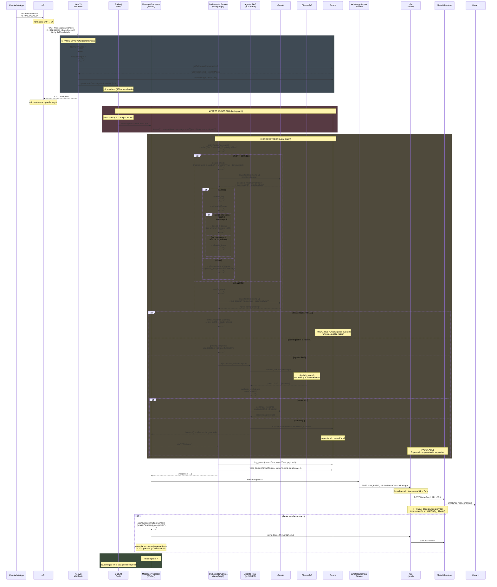
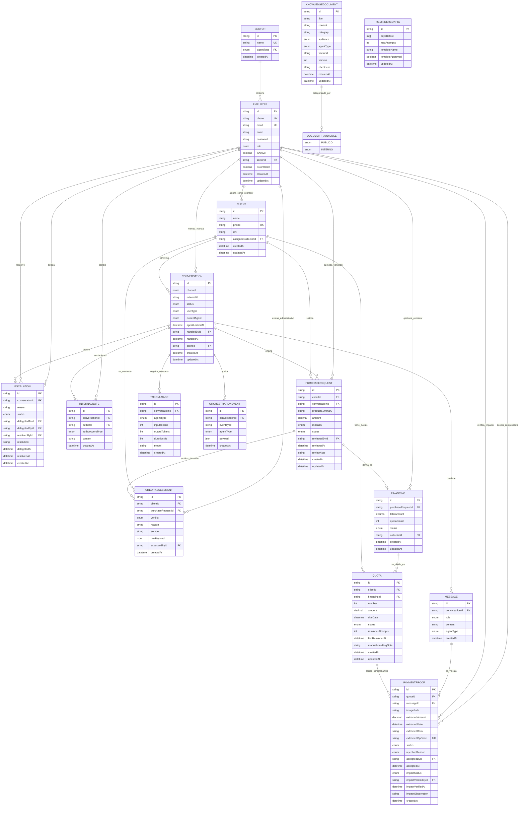

# Diagramas de Arquitectura — TrimIA

## 0b. Módulos del Sistema (22 total)

TrimIA está organizado en **4 capas de módulos** según responsabilidad, no por orden alfabético. Esto hace que la arquitectura sea clara de un vistazo.

### 🔧 Infraestructura Global (@Global, sin import explícito en cada módulo)

| Módulo | Ubicación | Rol |
|--------|-----------|-----|
| **AppConfigModule** | `config.module.ts` | Carga y valida `.env` con Joi (falla rápido si falta variable requerida) |
| **PrismaModule** | `prisma.module.ts` | Cliente PostgreSQL vía Prisma (singleton global) |
| **RedisModule** | `redis.module.ts` | Cliente Redis para colas y caché |
| **LlmModule** | `llm.module.ts` | Cliente Gemini, inyectable en cualquier servicio |

### 🧠 Núcleo de IA (Agentes + RAG + Orquestación)

| Módulo | Ubicación | Rol |
|--------|-----------|-----|
| **KnowledgeModule** | `knowledge.module.ts` | Motor RAG — recuperación de contexto para agentes |
| **AgentsModule** | `agents.module.ts` | Lógica de los 5 agentes especializados (SALES/ADMIN/COLLECTIONS/LOGISTICS/DEPOSITS) |
| **OrchestratorModule** | `orchestrator.module.ts` | Orquesta flujo entre agentes, ruteo sticky, scope_check, classify_intent |
| **OrchestrationLoggerModule** | `orchestration-logger.module.ts` | Auditoría (OE-11): persiste OrchestrationEvent + TokenUsage (separado para evitar import cíclico) |

### 💼 Dominio de Negocio (Credimisión)

| Módulo | Ubicación | Rol |
|--------|-----------|-----|
| **ClientsModule** | `clients.module.ts` | Clientes + adaptador n8n (futuro: Paljet/CRM) |
| **SalesModule** | `sales.module.ts` | Alta de cliente, plan de cuotas, integración vendedor |
| **CollectionsModule** | `collections.module.ts` | **Sprint 4**: Cobranzas — cuotas, recordatorios, validación de comprobantes de pago |
| **EscalationsModule** | `escalations.module.ts` | Casos escalados a humano (human-in-the-loop, Sprint 3) |
| **EmployeesModule** | `employees.module.ts` | Empleados/supervisores, roles internos, autenticación |
| **SupervisorModule** | `supervisor.module.ts` | Panel del Supervisor — cola de pendientes, control manual, métricas |

### 📨 Mensajería y Colas

| Módulo | Ubicación | Rol |
|--------|-----------|-----|
| **ConversationsModule** | `conversations.module.ts` | Historial y estado de conversaciones (memoria a largo plazo) |
| **MessagingModule** | `messaging.module.ts` | Recepción de mensajes: webhook WhatsApp + validación |
| **WhatsappSenderModule** | `whatsapp-sender.module.ts` | Envío de mensajes por WhatsApp (separado para evitar ciclo con MessagingModule) |
| **WhatsappMediaModule** | `whatsapp-media.module.ts` | Descarga/persistencia de media (comprobantes, fotos). Separado por el mismo motivo |
| **QueueModule** | `queue.module.ts` | Workers BullMQ: 3 procesadores (message-processing, receipt-extraction, reminders) |

### 🔐 Transversal / Infraestructura de App

| Módulo | Ubicación | Rol |
|--------|-----------|-----|
| **AuthModule** | `auth.module.ts` | JWT + Passport + guards de roles (JwtAuthGuard, RoleGuard) |
| **HealthModule** | `health.module.ts` | Healthchecks (Terminus): `/health` endpoint para infra |

**Patrón detectado:** Varios módulos (WhatsappSenderModule, WhatsappMediaModule, OrchestrationLoggerModule) están deliberadamente separados de su "padre" con comentarios explícitos tipo "para evitar ciclo". Es la forma de NestJS de resolver dependencias circulares: en vez de `forwardRef()`, extraen el servicio compartido a su propio módulo chico. **Reconoce este patrón cuando veas un módulo con un solo servicio y ese comentario.**

---


## 1. El viaje de un mensaje — Secuencia Simplificada

> Desde que Meta entrega un mensaje hasta que vuelve al usuario. Muestra por qué es asíncrono (202 Accepted inmediato), cómo BullMQ evita condiciones de carrera (concurrency: 1), y qué pasa cuando el score RAG es bajo (escalada a humano = job termina, supervisor reanuda con job nuevo). Refleja estado actual del código: `classify_intent`/`scope_check` corren en `llm.classifierChat` (temperature 0, no el `llm.chat` de 0.7 que usan los agentes — un nodo de ruteo tiene que ser determinista), el atajo trivial (0 LLM) solo aplica **sin** agente sticky, `scope_check` puede resolver el agente destino en la misma llamada (`targetAgent`) y saltar `classify_intent`, retrieve_context en ChromaDB, evaluate_confidence con threshold 0.65.

Para ver un sequence diagram interactivo, abrí [este archivo en Mermaid Live](https://mermaid.live/) y pegá el código de abajo:



**Flujo resumido:**
1. **Síncrono (202 inmediato)**: webhook → validar → crear Conversation → encolar job → responder
2. **Asíncrono (background)**: worker → orquestador → agente RAG → evaluate_confidence
   - Si score ≥ 0.65: genera respuesta con Gemini
   - Si score < 0.65: pausa (escalada a humano)
3. **Respuesta**: envía por WhatsApp → n8n → Meta

**Por qué concurrency: 1:**
- Si dos mensajes del mismo usuario llegan rápido, el segundo espera en la cola
- Evita que dos workers lean y pisen el mismo checkpoint de LangGraph
- Garantiza que escaladas no se duplican

**Decisiones de diseño visibles en este flujo:**
- **202 Accepted inmediato**: webhook no espera a Gemini — n8n no sufre timeout
- **concurrency: 1**: un job por vez. Evita race conditions en checkpoints de LangGraph
- **Dos fases**: síncrona (webhook → validar → encolar) y asíncrona (worker → orquestador → respuesta)
- **Escalada termina job**: no cuelga esperando supervisor. Supervisor reanuda con **nuevo job** después
- **ChromaDB solo busca**: `retrieve_context` es O(log n), `evaluate_confidence` es puro filtro (0 tokens)
- **`classifierChat` a temperature 0** para `classify_intent` y `scope_check`: son decisiones de ruteo, no generación — necesitan ser estables (mismo mensaje → mismo agente en cada corrida). Los agentes RAG siguen generando con `llm.chat` a 0.7.
- **Atajo trivial solo sin sticky**: con un agente ya fijado, un "dale"/"ok" corto puede ser la confirmación a una pregunta que el bot mismo hizo (no una cortesía suelta) — el regex no distingue eso, así que con sticky siempre pasa por `scope_check`, que sí tiene el historial.
- **`scope_check` puede resolver `targetAgent` en la misma llamada**: si el usuario cambia de tema, el propio `scope_check` ya dice a qué agente corresponde, evitando una segunda llamada a `classify_intent`. Si no lo resuelve (o es ambiguo), `classify_intent` actúa de red de seguridad.
- **`trivial_response` ahora pasa por `log_event` + `track_tokens`**: antes iba directo a `END` y no dejaba ningún rastro en `OrchestrationEvent`/`TokenUsage`, invisible para la auditoría (OE-11).

---


## 2. Grafo — Detalle ASCII

> `classify_intent` y `scope_check` corren sobre `llm.classifierChat` (Gemini a `temperature: 0`, distinto del `llm.chat` a 0.7 que usan los agentes) — son decisiones de ruteo, tienen que ser deterministas: mismo mensaje, mismo agente, en cada corrida.

```
                              ┌─────────┐
                              │  START  │
                              └────┬────┘
                                   │
                          entryRouter()   
                                   │
                                   │
              ┌────────────────────┼───────────────────────┐
              │                    │                       │ 
     trivial  │              sticky│            orchestrate│
  (regex hola/gracias/etc.,  (currentAgent ya          (sin agente, o
   SOLO si NO hay sticky —   fijado y permitido)         sticky no
   ver nota 1)                                            permitido)
              │                    │                        │
              ▼                    ▼                        │
     ┌─────────────────┐   ┌────────────────────┐           │
     │ trivial_response│   │    scope_check      │           │
     │  (canned, 0 LLM)│   │ (classifierChat:    │           │
     └────────┬────────┘   │  ¿mismo/cambio? +   │           │
              │            │  ¿greeting? +       │           │
              │            │  greetingType? +    │           │
              │            │  targetAgent?)      │           │
              │            └──────────┬──────────┘           │
              │                       │                      │ 
              │                scopeRouter()                 │ 
              │                       │                      │      
              │        ┌──────────────┼──────────────┐       │
              │  mismo +│         mismo,│       cambio│       │
              │ greeting│     no greeting│            │       │
              │        ▼              ▼              ▼        │
              │        │      (agente actual)  ┌────────────┐ │
              │        │              │         │handoff_log│ │
              │        │              │         │ (Prisma)  │ │
              │        │              │         └─────┬─────┘ │
              │        │              │               │       │
              │        │              │               ▼       │
              │        │              │       postHandoffRouter()
              │        │              │               │       │
              │        │              │    ┌──────────┴──────────┐       │
              │        │              │ targetAgent│      sin targetAgent│
              │        │              │  resuelto  │   (red de seguridad)│
              │        │              │            │              │      │
              │        │              │            │              ▼      ▼
              │        │              │            │      ┌───────────────────────────┐
              │        │              │            │      │     classify_intent       │
              │        │              │            │      │ (classifierChat structured;│
              │        │              │            │      │  solo agentes permitidos) │
              │        │              │            │      └─────────────┬─────────────┘
              │        │              │            │                    │    
              │        │              │            │         classifyRouter()
              │        │              │            │                    │
              │        │              │            │        ┌───────────┴───────────┐
              │        │              │            │greeting│                 agente│
              │        │              │            │        ▼                       │
              │        │              │            │ ┌──────────────────┐           │
              │        └──────────────┼────────────┼▶│ greeting_response│           │
              │                       │            │ │ (usa greetingType:│          │
              │                       │            │ │  apertura|cierre) │          │
              │                       │            │ └────────┬─────────┘           │
              │                       │            │          │                     │
              │                ┌──────────────────┘┌─────────┘                      │
              │                │      │             │                               │       
              │                │      ▼             ▼                               ▼
              │                │   ┌────────────────────────────────────────────────────┐
              │                │   │   AGENTE RAG  (SALES│ADMIN│COLLECTIONS│LOGI│DEPO)  │
              │                │   │   1. retrieve_context  (ChromaDB, audiencia/role)  │
              │                │   │   2. evaluate_confidence  (score ≥ 0.65?)          │
              │                │   │      ├─ NO → escalate_to_human (canned)            │
              │                │   │      └─ SÍ → 3. generate_response                  │
              │                │   │   3. generate_response (llm.chat 0.7+contexto+hist)│
              │                │   │      → response + needsHuman? + internalNote?      │
              │                │   │      └─ 4. evaluateHandoff → escalate_by_agent?    │
              │                │   └────────────────────────┬───────────────────────────┘
              │                │                            ▼
              │                │                     ┌──────────────┐
              │                │                     │  log_event   │  (OrchestrationEvent → Prisma)
              │                │                     └──────┬───────┘
              │                │                            │
              │                │       ┌────────────────────┘
              │                ▼       ▼
              │               ┌──────────────┐
              │               │ track_tokens │  (TokenUsage → Prisma)
              │               └──────┬───────┘
              │                      │
              ▼                      ▼
           ┌─────────────────┐
           │       END       │
           └─────────────────┘

Notas:
1. entryRouter solo toma el atajo trivial (regex, 0 LLM) si NO hay agente sticky. Con
   sticky fijado, un "dale"/"ok" corto puede ser la confirmación a una pregunta que el
   bot hizo en el turno anterior — el regex no lo distingue, así que siempre pasa por
   scope_check (que sí tiene el historial).
2. trivial_response YA NO va directo a END: pasa por log_event (eventType=TRIVIAL_RESPONSE)
   → track_tokens (0 tokens, pero registra latencia). Antes no dejaba ningún rastro en
   OrchestrationEvent/TokenUsage — invisible para la auditoría (OE-11).
3. postHandoffRouter: si scope_check ya resolvió targetAgent en la misma llamada que
   decidió "cambio", salta directo al agente (se ahorra una llamada a classify_intent).
   Si no lo resolvió (o es ambiguo), classify_intent actúa de red de seguridad, igual
   que antes.
4. greeting_response ya no adivina con regex: usa greetingType ("apertura"/"cierre"),
   que sale de la MISMA llamada estructurada que decidió isGreeting (classify_intent o
   scope_check) — sin costo extra de tokens.
5. classify_intent y scope_check lanzan Error si Gemini no devuelve salida estructurada
   válida (result.parsed vacío) — antes fallaba silenciosamente más adelante.
6. Los routers (entryRouter, scopeRouter, postHandoffRouter, classifyRouter) son
   funciones puras: deciden el camino SIN llamar a Gemini. Solo classify_intent,
   scope_check y los agentes gastan tokens.

```

## 3. Agentes RAG — Patrón Común

```
Cada agente (SALES, ADMIN, COLLECTIONS, LOGISTICS, DEPOSITS) sigue
el mismo patrón, definido en: src/ai/agents/shared/rag-agent.graph.ts

┌────────────────────────────────────────────────────────────────────┐
│  buildRagAgentGraph(config, deps)                                  │
│  ├─ config: ConfigService (modelos, thresholds)                    │
│  ├─ deps: { llm, knowledge, logger }                              │
│  └─ return: AgentGraph (LangGraph)                                 │
└────────┬───────────────────────────────────────────────────────────┘
         │
         ▼
┌────────────────────────────────────────────────────────────────────┐
│                      Nodos del Grafo                               │
│                                                                     │
│  [1] retrieve_context                                              │
│      ├─ input: estado.input                                        │
│      ├─ action: KnowledgeService.search(                          │
│      │   query=estado.input,                                      │
│      │   audience=PUBLICO|PUBLICO+INTERNO,                       │
│      │   agentType=SALES|ADMIN|...                               │
│      │   k=4                                                       │
│      │ )                                                            │
│      ├─ output: estado.context = [doc1, doc2, ...]               │
│      └─ costo: 0 tokens (solo busca de vector)                    │
│                                                                     │
│  [2] evaluate_confidence                                           │
│      ├─ input: estado.context[]                                    │
│      ├─ logic: Si context.length > 0 && context[0].score >= 0.65  │
│      │          → alta confianza → generate_response              │
│      │          senó → escalate_to_human                          │
│      ├─ umbral: RAG_CONFIDENCE_THRESHOLD = 0.65 (observable)     │
│      └─ costo: 0 tokens (puro filtro)                             │
│                                                                     │
│  [3a] generate_response (si contexto confiable)                    │
│      ├─ input: estado.context, estado.input, estado.history      │
│      ├─ prompt: <agente>.prompt.ts                                │
│      │   (rol, personalidad, instrucciones de SALES/ADMIN/...)    │
│      ├─ action: LlmService.generate(                              │
│      │   messages=system+history+user,                            │
│      │   model=gemini-3.1-flash-lite,                            │
│      │   temperature=0.7,                                         │
│      │   maxTokens=512,                                           │
│      │   outputFormat=structured                                  │
│      │ )                                                            │
│      └─ output: {                                                  │
│           response: string,                                       │
│           needsHuman: boolean,  ← NEW                            │
│           handoffReason?: string, ← NEW                          │
│           internalNote?: string ← NEW (solo si needsHuman=true)  │
│         }                                                          │
│                                                                     │
│  [3b] escalate_to_human (si contexto débil, score < 0.65)        │
│      ├─ output: estado.response = "Un supervisor revisará pronto" │
│      ├─ acción: Conversation.status = WAITING_HUMAN              │
│      └─ efecto: supervisor lo ve en Panel (razón: confianza baja) │
│                                                                     │
│  [3c] escalate_by_agent (si generate_response.needsHuman = true) │
│      ├─ input: estado.response, estado.internalNote,             │
│      │         estado.handoffReason                              │
│      ├─ acción: Escalation.create({ reason, internalNote })      │
│      ├─ acción: Conversation.status = WAITING_HUMAN              │
│      └─ efecto: respuesta SÍ se envía al cliente + supervisor    │
│                 ve una nota interna específica del agente         │
│                                                                     │
│  [4] track_tokens                                                  │
│      ├─ input: tokens gastados en [3a] o [3b]                     │
│      └─ action: TokenUsage.create({                               │
│           agentType, inputTokens, outputTokens,                   │
│           conversationId                                           │
│        })                                                           │
│                                                                     │
└────────────────────────────────────────────────────────────────────┘

Cada agente tiene variantes:

  SALES / COLLECTIONS
  ├─ Audiencia: CLIENTE (solo PUBLICO)
  ├─ allowedFor: CLIENTE + EMPLEADO
  └─ Escalada: SÍ (si score < umbral)

  ADMIN
  ├─ Audiencia: EMPLEADO (PUBLICO + INTERNO)
  ├─ allowedFor: solo EMPLEADO
  ├─ Acceso especial: Riesgo Online API
  └─ Escalada: SÍ

  LOGISTICS / DEPOSITS
  ├─ Audiencia: EMPLEADO (PUBLICO + INTERNO)
  ├─ allowedFor: solo EMPLEADO
  └─ Escalada: NO (sin herramientas, solo RAG)

**Dos caminos de escalada a humano (distintos motivos, mismo destino WAITING_HUMAN):**

| Vía | Nodo | Razón | Respuesta al cliente | Nota al supervisor |
|-----|------|-------|----------------------|--------------------|
| **A: Confianza baja** | `escalate_to_human` | score RAG < 0.65 | Canned: "Un supervisor revisará pronto" | Razón: confianza insuficiente + score |
| **B: Decisión de agente** | `escalate_by_agent` | needsHuman=true (agente lo decidió) | Respuesta ya generada por Gemini + contexto | internalNote con resumen del caso |

Ejemplo de escenario B: cliente dice "quiero hablar con un supervisor"; el agente genera una respuesta útil pero marca needsHuman=true, y la internalNote acumula por qué ("usuario solicitó escalada manual"). El cliente recibe la respuesta inmediatamente y el supervisor ve el contexto completo en la nota interna, sin esperar a que el cliente escriba de nuevo.
```
## 4. Modelo de Datos — ER Diagram (Mermaid)

> Esquema de Prisma (PostgreSQL). Agrupa las entidades en subsistemas: conversaciones/mensajes/auditoría (el core), empleados/acceso (control), ventas y financiación, cobranzas (Sprint 4), y RAG/conocimiento. Omite las tablas de LangGraph checkpointer (viven en PostgreSQL pero sin gestión Prisma) y ChromaDB vectorial (otra DB, no relacional). Fuente: `prisma/schema.prisma`.
>
> **Agente y Base de Conocimiento no son tablas.** El diagrama de dominio los modela como entidades, pero acá viven como el enum `AgentType`: `Sector.agentType` cubre "Sector 1—1 Agente" y `KnowledgeDocument.agentType` cubre "Agente 1—1 BaseConocimiento → N Documentos". Físicamente hay **una sola colección** de ChromaDB (`trimia_knowledge`) filtrada por metadata `agentType` + `audience`; una colección por agente obligaría a duplicar los documentos generales (`agentType = null`) en las cinco.

