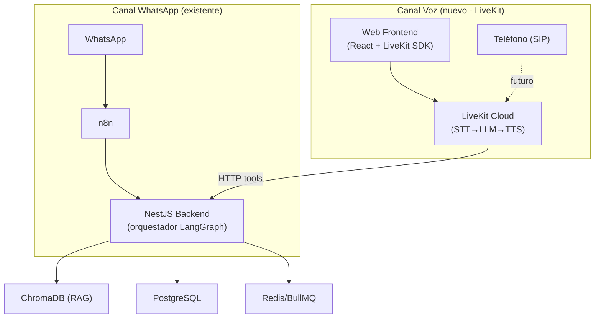

# Análisis: LiveKit Agent Builder para TrimIA (Asistencia por Voz)

> Fuentes: producto ([livekit.com/products/agent-builder](https://livekit.com/products/agent-builder)), docs ([docs.livekit.io/agents/start/builder/](https://docs.livekit.io/agents/start/builder/)), pricing ([livekit.com/pricing](https://livekit.com/pricing)), RAG docs ([docs.livekit.io/agents/logic/external-data/](https://docs.livekit.io/agents/logic/external-data/)), voice quickstart, y contexto técnico (`docs/CONTEXTO_TECNICO.md`).

---

## 1. ¿Qué es LiveKit Agent Builder?

Una herramienta **web sin código** para prototipar y deployar **voice agents** (agentes de voz). El flujo:

1. **Customizás** prompt, nombre, saludo inicial
2. **Elegís modelo** (STT → LLM → TTS pipeline, o modelo realtime como GPT Realtime)
3. **Definís acciones** (HTTP tools, Client tools via RPC, MCP servers)
4. **Preview** en vivo en el browser
5. **Deploy** a LiveKit Cloud con un click
6. **Convert to code** (exporta proyecto Python completo)

> [!IMPORTANT]
> El Agent Builder genera **código Python** (LiveKit Agents SDK). No genera Node.js/TypeScript directamente desde el builder, aunque el SDK completo sí tiene soporte para Node.js.

---

## 2. Mapping a requisitos de TrimIA

| Requisito TrimIA | Fuente | ¿LiveKit lo cubre? | Detalle |
|---|---|---|---|
| **RF-14**: Texto y audio (transcripción) | `CONTEXTO_TECNICO.md` §8, E6 | ✅ **Sí, de sobra** | Pipeline STT-LLM-TTS nativa; Deepgram Nova-3 multilingual para STT; múltiples voces TTS |
| **RF-08**: Atención en tiempo real | `CONTEXTO_TECNICO.md` §8, E2 | ✅ **Sí** | WebRTC de baja latencia (<250ms); turn detection inteligente |
| **RF-07**: Acceso multicanal (web + WhatsApp) | `CONTEXTO_TECNICO.md` §8, E2/E4 | ⚠️ **Parcial** | Excelente para canal Web (embed widget, frontend React); para WhatsApp necesitás integración telefónica SIP o mantener el flujo actual |
| RAG con base de conocimiento propia | `CONTEXTO_TECNICO.md` §5.4 | ✅ **Sí** | Soporte nativo para RAG via `on_user_turn_completed` hook o tool calls; se puede conectar a ChromaDB existente |
| Confidencialidad (OE-10, RNF-02) | `CONTEXTO_TECNICO.md` §5.3 | ⚠️ **Requiere trabajo** | El control `allowedAgentsFor(userType)` y filtrado de audiencia se tendría que reimplementar en el agente de LiveKit |
| 5 agentes con ruteo sticky | `CONTEXTO_TECNICO.md` §5.1, §5.2 | ⚠️ **Limitación** | El Agent Builder **no soporta** workflows, handoffs ni multi-agent. El SDK completo sí (exportando a código) |
| Escalado a humano | `CONTEXTO_TECNICO.md` §11 | ✅ **Con SDK** | Posible via handoffs del SDK, pero no desde el Agent Builder |

---

## 3. ¿Qué se puede y qué NO se puede hacer desde el Agent Builder?

### ✅ Se puede (sin código)
- Definir prompt/instrucciones del agente
- Elegir modelos STT/LLM/TTS
- Configurar HTTP tools (para llamar al backend NestJS de TrimIA)
- Configurar MCP servers
- Data collection (recopilar datos estructurados del usuario)
- Deploy a producción en 1 click
- Embeber en web con widget

### ❌ NO se puede (requiere exportar a código)
- **Workflows y handoffs** (multi-agente)
- **Tasks y task groups**
- **Modelos realtime** (speech-to-speech directo)
- **Vision** (procesamiento de imágenes)
- **Tests automatizados**

> [!WARNING]
> **Esto es la limitación clave para TrimIA**: el sistema tiene 5 agentes con ruteo orquestado. Desde el Agent Builder no podés replicar esa lógica. Tendrías que exportar a código y usar el SDK completo.

---

## 4. Pricing relevante

| Componente | Costo (Plan Build/Ship) | Nota |
|---|---|---|
| **Plan base** | **$0/mes (Build)** o **$50/mes (Ship)** | 1,000 min de sesión gratis/mes |
| STT (Deepgram Nova-3 Multi) | $0.0058/min | Español soportado |
| LLM (Gemini 3.1 Flash Lite) | $0.0010/min | Mismo modelo que usa TrimIA hoy |
| TTS (Cartesia Sonic 3) | $0.0300/min | Buena calidad, latencia baja |
| **Costo total por minuto** | **~$0.0368/min** | STT + LLM + TTS combinados |
| **Por hora de conversación** | **~$2.21/hora** | — |

> [!TIP]
> El tier **Build (gratis)** incluye 1,000 minutos mensuales de sesión. Para un PoC/tesis es más que suficiente. No requiere tarjeta de crédito.

### Alternativa más económica

| Config alternativa | Costo/min |
|---|---|
| STT: Deepgram Nova-3 Mono | $0.0048 |
| LLM: Gemini 2.5 Flash-Lite | $0.0004 |
| TTS: Deepgram Aura-2 | $0.0180 |
| **Total** | **$0.0232/min (~$1.39/hora)** |

---

## 5. Arquitectura: ¿Cómo encajaría con TrimIA?

### Estrategia recomendada

> [!IMPORTANT]
> **No reemplazar la arquitectura existente.** LiveKit se integra como un **canal más**, delegando la lógica de negocio al backend NestJS via HTTP tools.

1. **El agente de LiveKit** actúa como "frontend de voz" — recibe audio, lo transcribe (STT), genera respuesta con TTS
2. **La lógica de negocio** (ruteo sticky, RAG, confidencialidad, auditoría) **sigue en NestJS**
3. El agente de LiveKit llama al backend via HTTP tool (similar a como lo hace n8n hoy)
4. El backend responde con texto, LiveKit lo convierte a voz

---

## 6. Dos caminos posibles

### Camino A: Agent Builder como PoC rápido (recomendado para empezar)

| Paso | Esfuerzo | Detalle |
|---|---|---|
| 1. Crear cuenta LiveKit Cloud | 5 min | Gratis, sin tarjeta |
| 2. Configurar agente en Agent Builder | 30 min | Prompt, modelos, saludo |
| 3. Agregar HTTP tool apuntando a NestJS | 1 hora | `POST /messaging/voice-webhook` (nuevo endpoint) |
| 4. Embeber widget en frontend React (E4) | 2 horas | Copiar snippet del Agent Embed Widget |
| **Total** | **~4 horas** | PoC funcional end-to-end |

### Camino B: SDK completo (para producción)

| Paso | Esfuerzo | Detalle |
|---|---|---|
| 1. Exportar código del Agent Builder | 5 min | Download ZIP |
| 2. Agregar lógica multi-agente (handoffs) | 2-3 días | Mapear los 5 agentes de TrimIA |
| 3. Implementar RAG via `on_user_turn_completed` | 1 día | Conectar a ChromaDB o via HTTP al backend |
| 4. Control de confidencialidad | 1 día | `userType` via job metadata |
| 5. Self-host o deploy en LiveKit Cloud | 1 día | LiveKit es open source; se puede self-host |
| **Total** | **~5-7 días** | Producción con todas las features |

---

## 7. Pros y Contras para TrimIA

### ✅ Pros
- **Tiempo a PoC ridículamente bajo** — en una tarde tenés voz funcionando
- **Pipeline STT-LLM-TTS probada** — no tenés que armar la plumbing de audio vos
- **Soporta Gemini** (mismo LLM que usa TrimIA, `CONTEXTO_TECNICO.md` §2)
- **Open source** — el framework y el media server son MIT; podés self-hostear todo
- **SDK Node.js** — compatible con el stack TypeScript de TrimIA
- **RAG nativo** — hook `on_user_turn_completed` para inyectar contexto del ChromaDB
- **1,000 min gratis/mes** — sobra para una tesis
- **Embed widget** — se pega directo en el panel React (E4) sin esfuerzo

### ⚠️ Contras / Consideraciones
- **Agent Builder genera Python** — para producción con el stack TS de TrimIA habría que usar el Node.js SDK directamente (no el builder)
- **Duplicación de lógica** — si el agente de voz necesita ruteo propio, hay riesgo de duplicar el orquestador LangGraph; mejor delegar al backend
- **Costo operativo nuevo** — suma ~$0.037/min al costo por mensaje; hoy el texto puro no paga STT/TTS
- **Servicio nuevo en la infra** — otro componente que mantener (aunque se puede simplificar con LiveKit Cloud)
- **RF-14 ya menciona "transcripción"** — si el requisito es solo transcribir audios de WhatsApp (no conversación de voz bidireccional), LiveKit sería overkill vs. un simple llamado a la API de Deepgram/Whisper

---

## 8. Veredicto

> [!TIP]
> **Sí vale la pena evaluarlo**, pero la forma en que lo uses depende de qué exactamente significa "asistencia con voz" para TrimIA.

| Escenario | ¿LiveKit? | Alternativa |
|---|---|---|
| **Conversación de voz bidireccional en el panel web** (como hablar con un call center) | ✅ **Sí, es la herramienta correcta** | Armar STT+TTS manualmente es mucho más trabajo |
| **Transcribir audios de WhatsApp** (RF-14 literal) | ❌ **Overkill** | Deepgram/Whisper API directo desde NestJS |
| **Ambos** | ✅ + complemento | LiveKit para web/teléfono + API de transcripción para WhatsApp |

---

## 9. Próximos pasos sugeridos

1. **Definir el alcance de "asistencia con voz"** — ¿es conversación bidireccional en web? ¿transcripción de audios de WA? ¿ambos?
2. Si es conversación de voz → **crear cuenta en LiveKit Cloud y armar un PoC con el Agent Builder** (Camino A, ~4 horas)
3. Si es solo transcripción de audios → **integrar Deepgram o Whisper directo en NestJS** (más simple, sin nuevo servicio)
4. En cualquier caso, **no duplicar la lógica del orquestador** — el agente de voz debe delegar al backend NestJS

¿Querés que armemos el PoC o prefieras que primero afinemos qué caso de uso es el prioritario?
