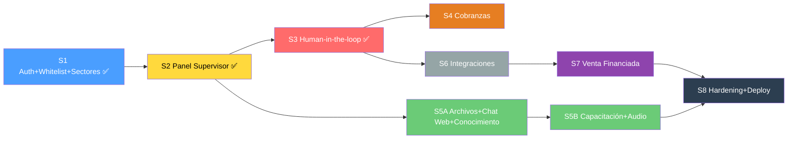

# Plan de Trabajo — TrimIA Backend (v5)

> **Fecha:** 2026-08-04 · **Fuentes:** `src/`, `docs/CONTEXTO_TECNICO.md`, `docs/diccionarioEDT.md`, `docs/requisitos.md`, `docs/CRM.xlsx`, `docs/prototipos.pdf`, memoria Claude Code.
>
> **v5 (2026-08-04):** revisión completa contra los prototipos de interfaz del equipo de frontend
> (`docs/prototipos.pdf`, 22 pantallas). Las decisiones de alcance tomadas en esa revisión están
> consolidadas en **§6 Recortes y decisiones confirmadas**; los sprints de abajo ya las reflejan.

---

## 1. Lo que YA funciona (Fases 1–4 + Sprints 1–3)

```
WhatsApp → n8n → webhook → BullMQ → MessageProcessor
  → orquestador (sticky) → agente RAG → respuesta → WhatsApp
```

Confidencialidad `audience`/`userType` ✅ · Memoria conversacional ✅ · Logging ✅ · 5 agentes RAG ✅

**Sprint 1** Auth JWT + whitelist + sectores ✅ · **Sprint 2** Panel del Supervisor (métricas,
conversaciones, eventos, `agents/status`) ✅ · **Sprint 3** Human-in-the-loop (escalado real,
takeover/release/reply, notas internas, delegar, "responder y enseñar a la IA") ✅ · 64 tests ✅

> [!NOTE]
> **Trazabilidad SDD:** adoptamos GitHub Spec Kit (Spec-Driven Development) recién a partir del
> Sprint 3, por eso `specs/001-human-in-the-loop/` es el primer spec formal. Las Fases 1-4 (Núcleo
> conversacional) y los Sprints 1-2 se implementaron antes de esa adopción y no tenían spec.
> Para no dejar el historial incompleto de cara a la tesis, se documentaron **retroactivamente**
> en `specs/000-linea-base/` (marcado explícitamente como spec escrito post-hoc, no como diseño
> previo a la implementación).

---

## 2. Sprints



> [!NOTE]
> El Sprint 5 se partió en **5A** y **5B** en la revisión v5: al incorporar la Base de
> Conocimiento y la pipeline de audio quedó con más de 20 tareas, inviable como un solo sprint.

---

### Sprint 1 — Auth JWT + Whitelist + Sectores 🔑 ✅ COMPLETO

| # | Tarea | Dónde | Criterio |
|---|-------|-------|---------|
| 1.1 | Modelo `Sector` | `schema.prisma` | 5 sectores: Ventas, Cobranzas, Administración, Logística, Depósito |
| 1.2 | Modelo `Employee` | `schema.prisma` | `phone`, `email`, `name`, `password`(hash), `role: EMPLEADO\|SUPERVISOR`, `sectorId`, `isActive`, timestamps |
| 1.3 | Módulo auth JWT | `src/auth/` | Login email/password → JWT. Guards: `JwtAuthGuard`, `RolesGuard`, `SectorGuard` |
| 1.4 | ABM whitelist | `src/employees/` | CRUD empleados. Solo SUPERVISOR. Cambios logueados (RF12, RNF-02) |
| 1.5 | Cablear `userType` real | `message.processor.ts` | Teléfono en Employee → `EMPLEADO`; si no → `CLIENTE` (RF12) |
| 1.6 | Seed | `prisma/seed.ts` | 5 empleados (1 por sector) + 1 supervisor. Datos de prueba para ChromaDB |
| 1.7 | Tests | `*.spec.ts` | Auth, whitelist, `userType`, sector filtering |

**Sectores → módulos del panel:**

| Sector | Módulos frontend que ve |
|--------|------------------------|
| Ventas | Cierres pendientes, Consulta financiada, Stock, Seguimiento clientes, Capacitación |
| Cobranzas | Panel de Cobranzas, Registro de actividad, Capacitación |
| Administración | Verificaciones crediticias, Auditoría, Capacitación |
| Logística | Capacitación |
| Depósito | Capacitación |
| **Supervisor** | **Todos + Gobernanza + Base de Conocimiento + Entrevistas + Config** |

> [!NOTE]
> Todos los empleados acceden a **capacitación interna** (los 5 agentes capacitan). El sector gatea los **módulos operativos** del panel, no el chat.

---

### Sprint 2 — Panel del Supervisor (endpoints) 🛡️ ✅ COMPLETO

| # | Tarea | Dónde | Criterio |
|---|-------|-------|---------|
| 2.1 | `GET /supervisor/conversations` | `supervisor.controller.ts` | Paginado, filtro por `status` (RF13, OE-11) |
| 2.2 | `GET /supervisor/conversations/:id` | `supervisor.controller.ts` | Detalle + historial mensajes |
| 2.3 | `GET /supervisor/events` | `supervisor.controller.ts` | Filtrable por `conversationId`, `eventType`, `after` (OE-11) |
| 2.4 | `GET /supervisor/agents/status` | `supervisor.service.ts` | Estado de agentes + % confianza promedio (del mockup) |
| 2.5 | Proteger con JWT + roles | Guards | Solo SUPERVISOR para gobernanza |
| 2.6 | Actualizar contrato API | `docs/CONTRATO_API_Frontend.md` | Reflejar endpoints reales |
| 2.7 | Tests | `*.spec.ts` | |

---

### Sprint 3 — Human-in-the-Loop ♻️ ✅ COMPLETO

| # | Tarea | Dónde | Criterio |
|---|-------|-------|---------|
| 3.1 | ~~Re-activar checkpointer~~ **descartado** | — | Resuelto **sin** checkpointer: la pausa ocurre *entre* invocaciones del grafo, no a mitad de una. `message.processor.ts` no invoca al orquestador si `status != ACTIVE`. Ver `specs/001-human-in-the-loop/research.md` §1 |
| 3.2 | Estado `HUMAN_HANDLING` | `schema.prisma` | Supervisor toma control → agente pausa |
| 3.3 | `POST .../takeover` | `supervisor.controller.ts` | Cambia a `HUMAN_HANDLING` |
| 3.4 | `POST .../release` | `supervisor.controller.ts` | Devuelve control |
| 3.5 | Cola de escalados | `supervisor.service.ts` | `?status=WAITING_HUMAN` con contexto y motivo del escalado |
| 3.6 | "Responder y enseñar a la IA" | `supervisor.controller.ts`, `knowledge.service.ts` | Respuesta al cliente + ingesta al RAG (RF06 retroalimentación) |
| 3.7 | Modelo `InternalNote` | `schema.prisma` | Notas internas del cobrador/supervisor en conversaciones |
| 3.8 | Delegar escalado | `supervisor.controller.ts` | Reasignar a otro supervisor/empleado |
| 3.9 | Tests | `*.spec.ts` | Flujo: escalado → takeover → respuesta → release |

---

### ✅ Sprint 4 — Cobranzas 💰 (Completado 2026-08-05)

*Pantallas del prototipo: Panel de Cobranzas (Fig 3), Revisar Comprobante (Fig 4), Control de Comprobantes (Fig 5-6), Registro de Actividad (Fig 7).*

**Estado:** Todas las 5 historias de usuario (US1-US5) implementadas y testeadas. 128 tests pasando. Endpoints documentados en `CONTRATO_API_Frontend.md`.

| # | Tarea | Dónde | Criterio |
|---|-------|-------|---------|
| 4.1 | **Modelo `Client`** ⭐ | `schema.prisma` | `name`, `phone` (↔ `Conversation.externalId`), `dni`, `assignedCollectorId`. **Prerequisito de todas las pantallas de Cobranzas y Ventas**: hoy la conversación sólo tiene `externalId`, sin nombre ni cobrador asignado. Postgres es la fuente de verdad; se escribe a Sheets (§6.2) |
| 4.2 | **Flag Cobrador Controlador** | `schema.prisma` | `Employee.isController`. `role` (EMPLEADO/SUPERVISOR) + `sector` ya gatean el resto; el Controlador es la única atribución del prototipo no derivable del sector |
| 4.3 | Modelos `Quota`, `PaymentProof` | `schema.prisma` | Quota: PENDING/AWAITING_CONFIRMATION/PAID/OVERDUE/MANUAL. PaymentProof: `extractedOpCode @unique`, `acceptedById`, `acceptedAt`, `impactStatus`, `impactVerifiedById`, `impactVerifiedAt` |
| 4.4 | Seed cuotas y clientes | `prisma/seed.ts` | Vencimiento día 10. Datos del prototipo |
| 4.5 | **Plantillas WhatsApp aprobadas** ⚠️ | n8n + Meta | **Bloqueante de 4.6.** Los recordatorios son proactivos y caen fuera de la ventana de 24 h de WA Business → exigen plantillas (HSM) aprobadas por Meta. Se adelanta desde 8.6, que estaba después de este sprint |
| 4.6 | Scheduler recordatorios | `src/queue/schedulers/` | BullMQ repeatable. 7/3/0 días antes. Máx 3 intentos. Configurable (RF04) |
| 4.7 | `ReminderConfig` | `schema.prisma` | Días antes, máx intentos por ciclo. Editable por supervisor |
| 4.8 | Tool `verifyReceipt` | `collections.graph.ts` | Comprobante → monto/opcode/banco/fecha vía Gemini Vision → escala al cobrador (RF04). **Los campos extraídos son sugerencia editable, nunca verdad del sistema**: el cobrador decide |
| 4.9 | Flujo confirmación | `collections.graph.ts` | Aviso → acuse → pausa recordatorios → cobrador acepta o marca problema (4 motivos predefinidos + mensaje previsualizado antes de enviar) |
| 4.10 | "Marcar como gestionado manualmente" | Endpoint | Estado MANUAL, detiene recordatorios. Es el *"Otro problema — voy a manejarlo yo"* del prototipo: reusa `takeover` + `InternalNote` de Sprint 3 |
| 4.11 | Endpoints panel cobranzas | `src/collections/` | KPIs (pendientes, comprobantes a revisar, confirmados esta semana), lista de clientes del cobrador, historial de contacto |
| 4.12 | **Control de Comprobantes** (rol Controlador) | `src/collections/` | Lista de comprobantes aceptados por todos los cobradores con días transcurridos + `POST .../verify-impact` (impactó / no impactó + observación). **Registro manual: TrimIA no se conecta al banco** |
| 4.13 | Registro de actividad | `src/collections/` | Timeline unificado: OrchestrationEvent + Message + InternalNote (filtrable). Las tres tablas ya están pobladas desde Sprint 3 |
| 4.14 | **Badges + notificación WhatsApp** | `src/collections/`, `WhatsappSenderService` | Contadores del sidebar por query (sin push ni websockets). WhatsApp sólo en críticos: pago que no impactó → cobrador responsable. Reusa `send()` y `Employee.phone`, que ya existen |
| 4.15 | Tests | `*.spec.ts` | Recordatorio → comprobante → confirmación → PAID → verificación de impacto |

> [!NOTE]
> **Diseño de la columna "Estado":** el prototipo mezcla en una sola columna el estado de la cuota,
> el del comprobante y el de la gestión de contacto. Modelar los tres por separado y que el frontend
> derive la etiqueta; si no, termina en un enum de ~15 valores imposible de mantener.

---

### Sprint 5A — Archivos, Chat Web y Base de Conocimiento 📚

*Pantallas del prototipo: Base de Conocimiento (Fig 15), Detalle de Conocimiento (Fig 16), Responder Consulta (Fig 13).*

| # | Tarea | Dónde | Criterio |
|---|-------|-------|---------|
| **Pipeline de archivos (RF06)** |||
| 5A.1 | File upload en `POST /knowledge` | `knowledge.controller.ts` | Acepta multipart: PDF, Word, imágenes, audio |
| 5A.2 | Extracción de texto PDF | `knowledge.service.ts` | Librería `pdf-parse` |
| 5A.3 | Extracción de texto Word | `knowledge.service.ts` | Librería `mammoth` |
| 5A.4 | Extracción de texto de imágenes | `knowledge.service.ts` | Gemini Vision (ya usamos Gemini). Cubre "fotos de fichas en papel" del prototipo |
| 5A.5 | Transcripción de audio subido | `knowledge.service.ts` | Google STT. Eliminar audio post-transcripción |
| **Audio WhatsApp (RF14)** |||
| 5A.6 | Google STT para WhatsApp | n8n (Workflow 7) | Audio WA → transcripción → webhook. Si error → pedir reformulación |
| **Chat web (RF07)** |||
| 5A.7 | `POST /messaging/web` | `src/messaging/` | Enviar mensaje, JWT auth. Mismo pipeline que WA |
| 5A.8 | `GET /messaging/web/:convId/messages` | `src/messaging/` | Historial compartido con WA (RF07) |
| **Base de Conocimiento (pantallas del supervisor)** |||
| 5A.9 | CRUD de conocimiento | `knowledge.controller.ts` | Hoy **sólo existe `POST`**. Faltan `GET /knowledge` (por área), `PUT`, `DELETE` y `isActive` para activar/desactivar sin borrar |
| 5A.10 | **Reindexación en ChromaDB al editar** ⚠️ | `knowledge.service.ts` | Editar no es sólo un UPDATE en Postgres: hay que reemplazar los chunks vectorizados. Si no se hace, la IA sigue respondiendo la versión vieja. `vectorId` y `version` ya existen en el modelo |
| 5A.11 | Trazabilidad del origen | `schema.prisma` | `sourceType` (documento / entrevista / escalado) + `sourceId`, para el "de dónde vino este conocimiento" del prototipo |
| 5A.12 | Indicador de recuperación | `knowledge.service.ts` | **Reemplaza la "confianza de la IA" del prototipo**, que no es medible como está descrita: veces que el documento fue recuperado + score promedio, calculado sobre datos ya persistidos |
| 5A.13 | "Editar con la IA" | `knowledge.service.ts` | El supervisor describe el cambio en lenguaje natural → Gemini propone el contenido modificado → **nunca se aplica sin aprobación explícita** |
| **Responder Consulta (completar Sprint 3)** |||
| 5A.14 | Sugerencia de respuesta | `escalations.service.ts` | `GET /supervisor/escalations/:id/suggestion`: Gemini redacta una propuesta con contexto RAG que el supervisor edita antes de aprobar |
| 5A.15 | Aprobar sin enviar + descartar | `escalations.service.ts` | Separar "aprobar y enviar" de "aprobar y guardar"; agregar `DISCARDED` a `EscalationStatus` (hoy sólo PENDING/RESOLVED) |
| 5A.16 | Tests | `*.spec.ts` | |

---

### Sprint 5B — Capacitación y Audio 🎧

*Pantallas del prototipo: Entrevista de Capacitación (Fig 14), Planificación (Fig 17), Inicio (Fig 18), Introducción (Fig 19), Teórica (Fig 20), Práctica (Fig 21), Simulación Libre (Fig 22).*

| # | Tarea | Dónde | Criterio |
|---|-------|-------|---------|
| **Entrevista de capacitación (RF11) — por chat de texto** |||
| 5B.1 | Modelo `InterviewSession` | `schema.prisma` | Área, progreso (4/9), estado, respuestas, pausar/reanudar |
| 5B.2 | `POST /interviews/message` | `src/interviews/` | Gemini genera la siguiente pregunta adaptativa. Opciones predefinidas + texto libre |
| 5B.3 | Al finalizar → ingesta RAG | `knowledge.service.ts` | Supervisor revisa/edita/aprueba antes de publicar (RF11) |
| **Contenido de capacitación (RF05)** |||
| 5B.4 | Módulo `src/training/` | `schema.prisma` | `TrainingModule`, `Pill`, `EmployeeProgress`. Desbloqueo secuencial por puesto |
| 5B.5 | Generación de píldoras | `src/training/` | Desde la entrevista + RAG: título, objetivo, contenido, 2 preguntas de verificación. Editable y aprobable por el supervisor |
| **Pipeline de audio (Gemini TTS)** |||
| 5B.6 | Generación del guion a 2 voces | `gemini-3.1-flash-lite` | Convierte el texto de la píldora en guion conversacional de dos locutores. Editable por el supervisor. **El guion ES la transcripción** — no hace falta alineación forzada |
| 5B.7 | Generación de audio TTS | `gemini-3.1-flash-tts-preview` | `multiSpeakerVoiceConfig` (2 locutores), tono rioplatense por prompt. Salida PCM 24 kHz base64 → MP3. Job BullMQ disparado al aprobar la píldora. **Píldoras ≤5 min** (la calidad se degrada más allá). Reintentos: el modelo es *preview* y a veces devuelve texto en vez de audio |
| 5B.8 | Storage de audio | `src/training/` | No existe object storage hoy. Volumen + endpoint de servido para dev; GCS al desplegar |
| 5B.9 | Progreso de reproducción | `src/training/` | Tracking del 80% escuchado para desbloquear el resumen de texto |
| **Práctica y simulación** |||
| 5B.10 | Práctica Guiada | `src/training/` | El agente asume rol de cliente (prompt de rol + historial, sobre la infraestructura que ya existe). Panel de guía con checklist en vivo vía structured output |
| 5B.11 | Simulación Libre | `src/training/` | Mismo mecanismo sin panel de guía. Estética de WhatsApp/Instagram es **sólo cosmética del frontend** — los canales reales siguen siendo WHATSAPP y WEB |
| 5B.12 | Feedback final | `src/training/` | 3 tarjetas (qué hizo bien / a mejorar / reglas). **Bandas cualitativas por dimensión** (Logrado / A mejorar / No logrado), no puntaje sobre 100: un LLM puntuando /100 no es reproducible |
| 5B.13 | Diagnóstico inicial | `src/training/` | Test de 5 min que permite saltear contenido ya conocido |
| 5B.14 | Tests | `*.spec.ts` | |

---

### Sprint 6 — Integraciones (n8n + mocks) ⚙️
*CRM y Riesgo se pueden adelantar. Paljet post-reunión con cliente.*

| # | Tarea | Dónde | Criterio |
|---|-------|-------|---------|
| 6.1 | Módulo `src/ai/integrations/` con puertos | `ports/stock.port.ts`, `credit.port.ts`, `crm.port.ts` | Interfaces TypeScript (RNF-04) |
| 6.2 | CRM real: n8n→Google Sheets | `adapters/n8n-crm.adapter.ts` + WF 4/5/6 | `createProspect()`, `searchProspect()`, `addFollowUp()` (RI-03). **Dirección de sincronización: Postgres es la fuente de verdad y escribe a Sheets.** Se lee de Sheets sólo al dar de alta, para no duplicar un cliente ya cargado a mano por otra área. Sin sincronización bidireccional |
| 6.3 | Mock Stock (Paljet) | `adapters/mock-stock.adapter.ts` + seed | `checkAvailability()`. Modulado por userType. Sugerir alternativas (RF09). **Sin columna "ubicación en depósito"** (descartada hasta confirmar con el cliente) y la UI dice "última sincronización", no "tiempo real" |
| 6.4 | Mock Crédito (Riesgo Online) | `adapters/mock-credit.adapter.ts` + seed | `checkCredit()`. Solo ADMIN. Degradación graceful (RF10) |
| 6.5 | Tools en agentes | `sales.graph.ts`, `admin.graph.ts` | Stock+CRM en SALES, Crédito en ADMIN |
| 6.6 | Endpoints panel ventas | `src/sales/` | Cierres pendientes, `GET /sales/stock`, seguimiento de clientes. **`POST /sales/credit-check` invoca internamente al agente ADMIN** y devuelve sólo el dictamen (aprobado / con condiciones / rechazado) sin el detalle crediticio — respeta OE-10 y la exclusividad de Riesgo Online |
| 6.7 | Structured output de SALES | `sales.graph.ts` | Al escalar → resumen: producto, precio, modalidad, crédito, observación pendiente (Gemini structured output). Alimenta las tarjetas de Cierres Pendientes |
| 6.8 | Retomar contacto = takeover | `src/sales/` | El vendedor responde **desde TrimIA** con el `takeover`/`reply` de Sprint 3, no con un deep link `wa.me`: así el cliente ve un solo hilo, el agente no pierde contexto y queda auditado |
| 6.9 | Cerrar venta (manual) | `src/sales/` | Checkbox "marcar como cerrada" una vez registrada en Paljet a mano. **TrimIA no escribe en Paljet** |
| 6.10 | Tests | `*.spec.ts` | Ports + adapters. Desconectar integración sin afectar otros agentes (RNF-04) |

---

### Sprint 7 — Flujo de Venta Financiada 🏦

| # | Tarea | Dónde | Criterio |
|---|-------|-------|---------|
| 7.1 | Detección financiación en SALES | `sales.graph.ts` | Detecta intención → inicia sub-flujo (RF13) |
| 7.2 | Invocación interna ADMIN | `admin.graph.ts` | Consulta `CreditPort` → dictamen: aprobado/condiciones/rechazado (RF13) |
| 7.3 | Derivación a supervisor | `escalations.service.ts` (o checkpointer) | WAITING_HUMAN con resumen estructurado. Cliente no ve detalles (RF13). **Evaluar primero reusar el mecanismo de `Escalation` de Sprint 3**, que ya funciona; el checkpointer sólo hace falta si hay que pausar *dentro* de una misma ejecución del grafo |
| 7.4 | Cierre por supervisor | `supervisor.controller.ts` | Confirma → comunica aprobado/rechazado. Cada etapa registrada (OE-11) |
| 7.5 | Tests | `*.spec.ts` | Flujo end-to-end |

---

### Sprint 8 — Hardening y Despliegue 🚀

| # | Tarea | Dónde | Criterio |
|---|-------|-------|---------|
| 8.1 | Corpus real Credimisión | `knowledge.service.ts` | Cargado y validado (RF06) |
| 8.2 | Ingesta Google Drive | `knowledge.service.ts` | Detalle créditos, productos |
| 8.3 | Mejorar chunking | `knowledge.service.ts` | Corte inteligente para docs reales |
| 8.4 | Tests integración E2E | `test/` | Cada agente + tools + flujos |
| 8.5 | Despliegue GCP | Cloud Run + Cloud SQL | RNF-01: 99% uptime |
| 8.6 | WA Business productivo | n8n + Meta | Token permanente. Opt-out procesado (RI-04). ⚠️ **La aprobación de plantillas se adelanta al Sprint 4** (tarea 4.5): sin ellas no hay recordatorios de cobranza |

---

## 3. Workflows n8n (a crear juntos)

| # | Nombre | Sprint | Dirección |
|---|--------|--------|-----------|
| 1–3 | Verificación/Recepción/Envío WA | ✅ Existen | — |
| **4** | CRM: Buscar prospecto (phone → Google Sheets) | S6 | NestJS→Sheets |
| **5** | CRM: Crear prospecto (datos → nueva fila) | S6 | NestJS→Sheets |
| **6** | CRM: Actualizar seguimiento (phone → update fila) | S6 | NestJS→Sheets |
| **7** | Audio: Transcripción STT (WA audio → texto) | S5A | WA→STT→NestJS |
| **8** | WA: Envío con plantilla aprobada (recordatorios de cuota + notificación al cobrador) | **S4** | NestJS→Meta |

---

## 4. Estructura CRM Google Sheet — Referencia

**Hoja "CRM" (17 columnas):** Fecha primer contacto, Nombre, Teléfono, Comercio, Rubro, Localidad, Canal origen, Producto/s, Consulta/Venta, Medio de pago, Planes, Objeciones, Observaciones, Rebatir Objeción, Seguimiento, Fecha último contacto, Fecha próximo contacto.

**Hoja "BD" (dropdowns):** Medios (Online/Salón/Llamada), Orígenes (8 valores), ~70 localidades con cobrador por zona, anticipos.

---

## 5. Seed de datos (Sprint 1)

| Nombre | Sector | Rol | Teléfono |
|--------|--------|-----|----------|
| Laura Gómez | Ventas | EMPLEADO | 5491100001111 |
| Roberto Sosa | Cobranzas | EMPLEADO | 5491100002222 |
| Graciela Medina | Administración | EMPLEADO | 5491100003333 |
| Carlos Ruiz | Logística | EMPLEADO | 5491100004444 |
| Ana Torres | Depósito | EMPLEADO | 5491100005555 |
| Diego Bazán | — (todos) | SUPERVISOR | 5491100006666 |

> [!NOTE]
> **Sprint 4 agrega** una Cobradora Controladora (`isController: true`, sector Cobranzas) para poder
> probar el Control de Comprobantes con dos personas distintas, como muestra el prototipo
> (Roberto Sosa cobrador / Graciela Medina controladora).

---

## 6. Recortes y decisiones confirmadas

### 6.1 Recortes previos

| Recortado | Justificación |
|-----------|--------------|
| ~~Verificación de pago en dos pasos~~ | **Revertido en v5**: el prototipo lo pide explícitamente (cobrador acepta → controlador verifica impacto a los 2-3 días) y responde a una práctica real del negocio. Vuelve como tarea 4.12 |
| ~~Generar manual del área como PDF~~ | No está en requisitos. Trabajo futuro. **Confirmado** en la revisión v5 |
| ~~"Registrar venta en Paljet" (escritura)~~ | RNF-04 dice solo lectura. Se marca como cerrada a mano (tarea 6.9) |

### 6.2 Decisiones de la revisión contra prototipos (2026-08-04)

**Descartado:**

| Qué | Dónde aparecía | Por qué |
|-----|----------------|---------|
| **LiveKit / entrevista por voz** | Tarea 5.7 del plan v4 | El prototipo resuelve la entrevista **por chat de texto**, que cumple el mismo objetivo reusando lo que ya existe. LiveKit era infraestructura entera (agente, STT/TTS, latencia, costos) para un beneficio marginal |
| **Manual formal en PDF/Word** | Base de Conocimiento (Fig 15) | Generador de documentos completo (índice automático, confianza por sección, anexos) que no aporta a ningún objetivo específico |
| **Escritura en Paljet** | Consulta de Venta Financiada (Fig 9) | Paljet es mock hasta la reunión con el cliente y no sabemos si tiene API de escritura |
| **Columna "ubicación en depósito"** | Consultar Stock (Fig 10) | Asume que Paljet tiene el layout del depósito cargado, cosa improbable |
| **Deep link `wa.me`** | Cierres de Venta (Fig 8) | Abre el WhatsApp personal del vendedor, no la línea de la empresa: el cliente vería dos hilos y esa parte no quedaría auditada. Se reemplaza por el takeover interno |
| **Gamificación (racha y puntos)** | Capacitación (Fig 18) | Ruido para una tesis de grado. Queda sólo el contador de progreso |
| **Puntaje sobre 100** | Simulación Libre (Fig 22) | Un LLM puntuando /100 no es reproducible (la misma simulación da 84 o 91). Se reemplaza por bandas cualitativas por dimensión |
| **Podcast API de NotebookLM** | Alternativa evaluada para el audio | **Depreciada por Google**, no aceptan clientes nuevos en la allowlist |
| **Audio Overviews API** | Alternativa evaluada para el audio | `v1alpha` bajo Pre-GA Terms, exige licencia Gemini Enterprise y un notebook con las fuentes cargadas. Acoplaría TrimIA a un producto pago y en preview |

**Conservado o ampliado:**

| Qué | Decisión |
|-----|----------|
| **Audio de las píldoras** | **Se mantiene completo**, con `gemini-3.1-flash-tts-preview` — la misma API de Gemini que ya usamos, sin licencia ni producto nuevo. Multi-speaker de 2 locutores, español, estilo por prompt. El guion generado sirve además como transcripción |
| **"Confianza de la IA" por documento** | Redefinida como indicador de recuperación real (veces recuperado + score promedio), calculable con datos que ya persistimos |
| **Consulta crediticia del vendedor** | La pantalla queda, pero por detrás invoca al agente ADMIN y devuelve sólo el dictamen |
| **Modelo `Client`** | Se agrega en Postgres como fuente de verdad; el CRM en Sheets se sigue usando (lo comparten otras áreas) y se escribe desde TrimIA |
| **Roles** | `role` + `sector` (ya existen) + un flag `isController`. No se infla el enum `EmployeeRole` |
| **Notificaciones** | Badges por query + WhatsApp en los 2-3 casos críticos. Sin websockets |
| **"Editar con la IA"** | Va con prioridad normal (tarea 5A.13), siempre con aprobación humana |
| **Diagnóstico de 5 min** | Se conserva (tarea 5B.13) |
| **Estética Instagram/Facebook** | Cosmética del frontend. **Ojo en la redacción de la tesis:** no implica integración con esas plataformas |

### 6.3 Malentendidos del prototipo a corregir en la redacción

- **Las palabras clave no determinan qué encuentra la IA.** El prototipo dice que "permiten encontrarla cuando alguien haga una pregunta similar"; la búsqueda es semántica por embeddings y las keywords no cambian el recall. Pueden mostrarse como etiquetas descriptivas.
- **"Tiempo real" es polling.** El propio prototipo muestra "Actualizado hace 2 min" + botón Actualizar, que es lo correcto. No prometer streaming ni websockets.
- **La verificación de impacto no es conciliación bancaria.** TrimIA no se conecta al banco: la persona mira la cuenta y registra.

---

## 7. Cross-reference Requisitos → Sprint

| Req | Sprint | Estado |
|-----|--------|--------|
| RF01 | ✅ + S5A + S6 | Parcial (falta chat web + stock) |
| RF02 | ✅ Hecho | Orquestador |
| RF03 | S6 | CRM n8n→Sheets (Postgres fuente de verdad) |
| RF04 | S4 | Cobranzas completo |
| RF05 | S5B | Capacitación por rol + audio |
| RF06 | S5A + ✅ S3 | Pipeline archivos + retroalimentación (ya funciona vía `teachAgent`) |
| RF07 | S5A | Chat web + historial compartido |
| RF08 | ✅ Hecho | WhatsApp |
| RF09 | S6 | StockPort + alternativas |
| RF10 | S6 + S7 | CreditPort + degradación |
| RF11 | S5B | Entrevista guiada **por chat** + revisar/aprobar |
| RF12 | ✅ S1 | Whitelist + sectores |
| RF13 | S7 | Venta financiada E2E |
| RF14 | S5A | STT + eliminar audio |
| RNF-01 | S8 | Performance + uptime |
| RNF-02 | ✅ + S1 | Confidencialidad + JWT |
| RNF-03 | ✅ + S3 | RAG confidence + capitalización |
| RNF-04 | S6 | Port/adapter desacoplado |
| RI-01 | S6 | Paljet mock/real (solo lectura) |
| RI-02 | S6 | Riesgo Online mock (vía agente ADMIN) |
| RI-03 | S6 | CRM Google Sheets |
| RI-04 | ✅ + S4 + S8 | WA Business + plantillas + opt-out |

**22/22 requisitos cubiertos.**

---

## 8. Estado y próximo paso

> [!IMPORTANT]
> **Sprints 1, 2 y 3 completos.** El siguiente es el **Sprint 4 (Cobranzas)**, que arranca por el
> modelo `Client` (4.1) porque bloquea todas las pantallas de Cobranzas y de Ventas.
>
> Camino crítico a vigilar: **la aprobación de plantillas de WhatsApp (4.5)** depende de Meta y no
> de nosotros. Conviene iniciarla apenas empiece el sprint, en paralelo con el resto de las tareas.
