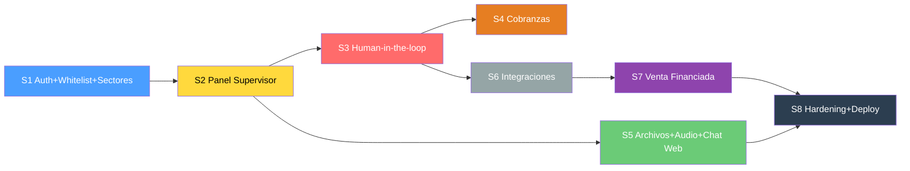

# Plan de Trabajo — TrimIA Backend (v4 definitivo)

> **Fecha:** 2026-07-18 · **Fuentes:** `src/`, `docs/CONTEXTO_TECNICO.md`, `docs/diccionarioEDT.md`, `docs/requisitos.md`, `docs/CRM.xlsx`, memoria Claude Code, mockups frontend, `docs/voice_strategy_comparison.md`.

---

## 1. Lo que YA funciona (Fases 1–4)

```
WhatsApp → n8n → webhook → BullMQ → MessageProcessor
  → orquestador (sticky) → agente RAG → respuesta → WhatsApp
```

Confidencialidad `audience`/`userType` ✅ · Memoria conversacional ✅ · Logging ✅ · 5 agentes RAG ✅ · `GET /supervisor/metrics` ✅ · 34 tests ✅

---

## 2. Sprints



---

### Sprint 1 — Auth JWT + Whitelist + Sectores 🔑

| # | Tarea | Dónde | Criterio |
|---|-------|-------|---------|
| 1.1 | Modelo `Sector` | `schema.prisma` | 5 sectores: Ventas, Cobranzas, Administración, Logística, Depósito |
| 1.2 | Modelo `Employee` | `schema.prisma` | `phone`, `email`, `name`, `password`(hash), `role: EMPLEADO\|SUPERVISOR`, `sectorId`, `isActive`, timestamps |
| 1.3 | Módulo auth JWT | `src/auth/` | Login email/password → JWT. Guards: `JwtAuthGuard`, `RolesGuard`, `SectorGuard` |
| 1.4 | ABM whitelist | `src/employees/` | CRUD empleados. Solo SUPERVISOR. Cambios logueados (RF12, RNF-02) |
| 1.5 | Cablear `userType` real | `message.processor.ts` | Teléfono en Employee → `EMPLEADO`; si no → `CLIENTE` (RF12) |
| 1.6 | Seed | `prisma/seed.ts` | 5 empleados (1 por sector) + 1 supervisor. Datos de prueba para ChromaDB |
| 1.7 | Tests | `*.spec.ts` | Auth, whitelist, `userType`, sector filtering |

**Sectores → módulos del panel:**

| Sector | Módulos frontend que ve |
|--------|------------------------|
| Ventas | Cierres pendientes, Consulta financiada, Stock, Seguimiento clientes, Capacitación |
| Cobranzas | Panel de Cobranzas, Registro de actividad, Capacitación |
| Administración | Verificaciones crediticias, Auditoría, Capacitación |
| Logística | Capacitación |
| Depósito | Capacitación |
| **Supervisor** | **Todos + Gobernanza + Base de Conocimiento + Entrevistas + Config** |

> [!NOTE]
> Todos los empleados acceden a **capacitación interna** (los 5 agentes capacitan). El sector gatea los **módulos operativos** del panel, no el chat.

---

### Sprint 2 — Panel del Supervisor (endpoints) 🛡️

| # | Tarea | Dónde | Criterio |
|---|-------|-------|---------|
| 2.1 | `GET /supervisor/conversations` | `supervisor.controller.ts` | Paginado, filtro por `status` (RF13, OE-11) |
| 2.2 | `GET /supervisor/conversations/:id` | `supervisor.controller.ts` | Detalle + historial mensajes |
| 2.3 | `GET /supervisor/events` | `supervisor.controller.ts` | Filtrable por `conversationId`, `eventType`, `after` (OE-11) |
| 2.4 | `GET /supervisor/agents/status` | `supervisor.service.ts` | Estado de agentes + % confianza promedio (del mockup) |
| 2.5 | Proteger con JWT + roles | Guards | Solo SUPERVISOR para gobernanza |
| 2.6 | Actualizar contrato API | `docs/CONTRATO_API_Frontend.md` | Reflejar endpoints reales |
| 2.7 | Tests | `*.spec.ts` | |

---

### Sprint 3 — Human-in-the-Loop ♻️

| # | Tarea | Dónde | Criterio |
|---|-------|-------|---------|
| 3.1 | Re-activar checkpointer | `orchestrator.service.ts` | `interrupt()`/`resume()` con `conversationId` como `thread_id` |
| 3.2 | Estado `HUMAN_HANDLING` | `schema.prisma` | Supervisor toma control → agente pausa |
| 3.3 | `POST .../takeover` | `supervisor.controller.ts` | Cambia a `HUMAN_HANDLING` |
| 3.4 | `POST .../release` | `supervisor.controller.ts` | Devuelve control |
| 3.5 | Cola de escalados | `supervisor.service.ts` | `?status=WAITING_HUMAN` con contexto y motivo del escalado |
| 3.6 | "Responder y enseñar a la IA" | `supervisor.controller.ts`, `knowledge.service.ts` | Respuesta al cliente + ingesta al RAG (RF06 retroalimentación) |
| 3.7 | Modelo `InternalNote` | `schema.prisma` | Notas internas del cobrador/supervisor en conversaciones |
| 3.8 | Delegar escalado | `supervisor.controller.ts` | Reasignar a otro supervisor/empleado |
| 3.9 | Tests | `*.spec.ts` | Flujo: escalado → takeover → respuesta → release |

---

### Sprint 4 — Cobranzas 💰

| # | Tarea | Dónde | Criterio |
|---|-------|-------|---------|
| 4.1 | Modelos `Installment`, `PaymentProof` | `schema.prisma` | Installment: PENDING/AWAITING_CONFIRMATION/PAID/OVERDUE/MANUAL. PaymentProof: `extractedOpCode @unique` |
| 4.2 | Seed cuotas | `prisma/seed.ts` | Vencimiento día 10. Datos del mockup |
| 4.3 | Scheduler recordatorios | `src/queue/schedulers/` | BullMQ repeatable. 7/3/0 días antes. Máx 3 intentos. Configurable (RF04) |
| 4.4 | `ReminderConfig` | `schema.prisma` | Días antes, máx intentos por ciclo. Editable por supervisor |
| 4.5 | Tool `verifyReceipt` | `collections.graph.ts` | Comprobante → monto/opcode → valida → escala a supervisor (RF04) |
| 4.6 | Flujo confirmación | `collections.graph.ts` | Aviso → acuse → pausa recordatorios → supervisor confirma/rechaza |
| 4.7 | "Marcar como gestionado manualmente" | Endpoint | Estado MANUAL, detiene recordatorios |
| 4.8 | Endpoints panel cobranzas | `src/collections/` | KPIs (pendientes, comprobantes, confirmados), lista clientes, historial contacto |
| 4.9 | Registro de actividad | `src/collections/` | Timeline unificado: OrchestrationEvent + Message + InternalNote (filtrable) |
| 4.10 | Tests | `*.spec.ts` | Recordatorio → comprobante → confirmación → PAID |

---

### Sprint 5 — Archivos, Audio, Chat Web, Capacitación y Entrevistas 🎙️

| # | Tarea | Dónde | Criterio |
|---|-------|-------|---------|
| **Pipeline de archivos (RF06)** |||
| 5.1 | File upload en `POST /knowledge` | `knowledge.controller.ts` | Acepta multipart: PDF, Word, imágenes, audio |
| 5.2 | Extracción de texto PDF | `knowledge.service.ts` | Librería `pdf-parse` |
| 5.3 | Extracción de texto Word | `knowledge.service.ts` | Librería `mammoth` |
| 5.4 | Extracción de texto de imágenes | `knowledge.service.ts` | Gemini Vision (ya usamos Gemini) |
| 5.5 | Transcripción de audio subido | `knowledge.service.ts` | Google STT. Eliminar audio post-transcripción |
| **Audio WhatsApp (RF14)** |||
| 5.6 | Google STT para WhatsApp | n8n (Workflow 7) | Audio WA → transcripción → webhook. Si error → pedir reformulación |
| **LiveKit (RF11)** |||
| 5.7 | LiveKit Agent para entrevistas | LiveKit Cloud | Agente con prompt de entrevista + data collection + HTTP tool a `/knowledge` |
| **Chat web (RF07)** |||
| 5.8 | `POST /messaging/web` | `src/messaging/` | Enviar mensaje, JWT auth. Mismo pipeline que WA |
| 5.9 | `GET /messaging/web/:convId/messages` | `src/messaging/` | Historial compartido con WA (RF07) |
| **Capacitación (RF05)** |||
| 5.10 | Módulo capacitación | `src/training/` | Contenidos por puesto/proceso/nivel. Audio/PDF por rol (RF05) |
| **Entrevista de capacitación (RF11)** |||
| 5.11 | Modelo `InterviewSession` | `schema.prisma` | Área, progreso (4/9), estado, respuestas, pausar/reanudar |
| 5.12 | `POST /interviews/message` | `src/interviews/` | Gemini genera siguiente pregunta adaptativa. Opciones + texto libre |
| 5.13 | Al finalizar → ingesta RAG | `knowledge.service.ts` | Supervisor revisa/edita/aprueba antes de publicar (RF11) |
| 5.14 | Tests | `*.spec.ts` | |

---

### Sprint 6 — Integraciones (n8n + mocks) ⚙️
*CRM y Riesgo se pueden adelantar. Paljet post-reunión con cliente.*

| # | Tarea | Dónde | Criterio |
|---|-------|-------|---------|
| 6.1 | Módulo `src/ai/integrations/` con puertos | `ports/stock.port.ts`, `credit.port.ts`, `crm.port.ts` | Interfaces TypeScript (RNF-04) |
| 6.2 | CRM real: n8n→Google Sheets | `adapters/n8n-crm.adapter.ts` + WF 4/5/6 | `createProspect()`, `searchProspect()`, `addFollowUp()` (RI-03) |
| 6.3 | Mock Stock (Paljet) | `adapters/mock-stock.adapter.ts` + seed | `checkAvailability()`. Modulado por userType. Sugerir alternativas (RF09) |
| 6.4 | Mock Crédito (Riesgo Online) | `adapters/mock-credit.adapter.ts` + seed | `checkCredit()`. Solo ADMIN. Degradación graceful (RF10) |
| 6.5 | Tools en agentes | `sales.graph.ts`, `admin.graph.ts` | Stock+CRM en SALES, Crédito en ADMIN |
| 6.6 | Endpoints panel ventas | `src/sales/` | Cierres pendientes, `POST /sales/credit-check`, `GET /sales/stock`, seguimiento clientes |
| 6.7 | Structured output de SALES | `sales.graph.ts` | Al escalar → resumen: producto, precio, modalidad, crédito (Gemini structured output) |
| 6.8 | Tests | `*.spec.ts` | Ports + adapters. Desconectar integración sin afectar otros agentes (RNF-04) |

---

### Sprint 7 — Flujo de Venta Financiada 🏦

| # | Tarea | Dónde | Criterio |
|---|-------|-------|---------|
| 7.1 | Detección financiación en SALES | `sales.graph.ts` | Detecta intención → inicia sub-flujo (RF13) |
| 7.2 | Invocación interna ADMIN | `admin.graph.ts` | Consulta `CreditPort` → dictamen: aprobado/condiciones/rechazado (RF13) |
| 7.3 | Derivación a supervisor | Checkpointer `interrupt` | WAITING_HUMAN con resumen estructurado. Cliente no ve detalles (RF13) |
| 7.4 | Cierre por supervisor | `supervisor.controller.ts` | Confirma → comunica aprobado/rechazado. Cada etapa registrada (OE-11) |
| 7.5 | Tests | `*.spec.ts` | Flujo end-to-end |

---

### Sprint 8 — Hardening y Despliegue 🚀

| # | Tarea | Dónde | Criterio |
|---|-------|-------|---------|
| 8.1 | Corpus real Credimisión | `knowledge.service.ts` | Cargado y validado (RF06) |
| 8.2 | Ingesta Google Drive | `knowledge.service.ts` | Detalle créditos, productos |
| 8.3 | Mejorar chunking | `knowledge.service.ts` | Corte inteligente para docs reales |
| 8.4 | Tests integración E2E | `test/` | Cada agente + tools + flujos |
| 8.5 | Despliegue GCP | Cloud Run + Cloud SQL | RNF-01: 99% uptime |
| 8.6 | WA Business productivo | n8n + Meta | Token permanente. Opt-out procesado (RI-04) |

---

## 3. Workflows n8n (a crear juntos)

| # | Nombre | Sprint | Dirección |
|---|--------|--------|-----------|
| 1–3 | Verificación/Recepción/Envío WA | ✅ Existen | — |
| **4** | CRM: Buscar prospecto (phone → Google Sheets) | S6 | NestJS→Sheets |
| **5** | CRM: Crear prospecto (datos → nueva fila) | S6 | NestJS→Sheets |
| **6** | CRM: Actualizar seguimiento (phone → update fila) | S6 | NestJS→Sheets |
| **7** | Audio: Transcripción STT (WA audio → texto) | S5 | WA→STT→NestJS |

---

## 4. Estructura CRM Google Sheet — Referencia

**Hoja "CRM" (17 columnas):** Fecha primer contacto, Nombre, Teléfono, Comercio, Rubro, Localidad, Canal origen, Producto/s, Consulta/Venta, Medio de pago, Planes, Objeciones, Observaciones, Rebatir Objeción, Seguimiento, Fecha último contacto, Fecha próximo contacto.

**Hoja "BD" (dropdowns):** Medios (Online/Salón/Llamada), Orígenes (8 valores), ~70 localidades con cobrador por zona, anticipos.

---

## 5. Seed de datos (Sprint 1)

| Nombre | Sector | Rol | Teléfono |
|--------|--------|-----|----------|
| Laura Gómez | Ventas | EMPLEADO | 5491100001111 |
| Roberto Sosa | Cobranzas | EMPLEADO | 5491100002222 |
| Graciela Medina | Administración | EMPLEADO | 5491100003333 |
| Carlos Ruiz | Logística | EMPLEADO | 5491100004444 |
| Ana Torres | Depósito | EMPLEADO | 5491100005555 |
| Diego Bazán | — (todos) | SUPERVISOR | 5491100006666 |

---

## 6. Recortes confirmados

| Recortado | Justificación |
|-----------|--------------|
| ~~Verificación de pago en dos pasos~~ | MVP: un solo paso de confirmación por supervisor |
| ~~Generar manual del área como PDF~~ | No está en requisitos. Trabajo futuro |
| ~~"Registrar venta en Paljet" (escritura)~~ | RNF-04 dice solo lectura. Botón abre Paljet manualmente |

---

## 7. Cross-reference Requisitos → Sprint

| Req | Sprint | Estado |
|-----|--------|--------|
| RF01 | ✅ + S5 + S6 | Parcial (falta chat web + stock) |
| RF02 | ✅ Hecho | Orquestador |
| RF03 | S6 | CRM n8n→Sheets |
| RF04 | S4 | Cobranzas completo |
| RF05 | S5 | Capacitación por rol |
| RF06 | S5 + S3 | Pipeline archivos + retroalimentación |
| RF07 | S5 | Chat web + historial compartido |
| RF08 | ✅ Hecho | WhatsApp |
| RF09 | S6 | StockPort + alternativas |
| RF10 | S6 + S7 | CreditPort + degradación |
| RF11 | S5 | Entrevista guiada + revisar/aprobar |
| RF12 | S1 | Whitelist + sectores |
| RF13 | S7 | Venta financiada E2E |
| RF14 | S5 | STT + eliminar audio |
| RNF-01 | S8 | Performance + uptime |
| RNF-02 | ✅ + S1 | Confidencialidad + JWT |
| RNF-03 | ✅ + S3 | RAG confidence + capitalización |
| RNF-04 | S6 | Port/adapter desacoplado |
| RI-01 | S6 | Paljet mock/real |
| RI-02 | S6 | Riesgo Online mock |
| RI-03 | S6 | CRM Google Sheets |
| RI-04 | ✅ + S8 | WA Business + opt-out |

**22/22 requisitos cubiertos.**

---

## 8. ¿Arrancamos?

> [!IMPORTANT]
> **Sprint 1 (Auth + Whitelist + Sectores)** es el primer paso. ¿Empezamos a codear?
