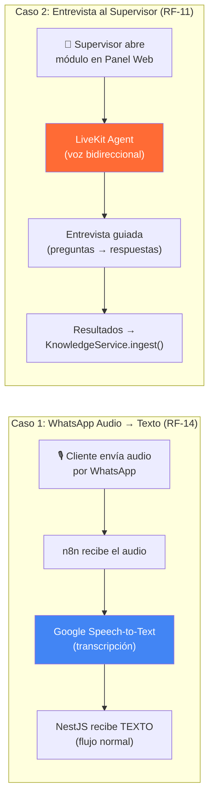

# Estrategia de Voz para TrimIA: Dos herramientas, dos propósitos

> Fuentes: `docs/CONTEXTO_TECNICO.md` §8 (RF-14, RF-11), §5.4 (RAG), §9 (E6).

---

## El panorama completo

Son **dos problemas distintos** que se resuelven con herramientas distintas:



---

## Caso 1: Google Speech-to-Text (clientes por WhatsApp)

### ¿Qué resuelve?
**RF-14**: "Texto y audio (transcripción)". Un cliente manda un audio por WhatsApp y el sistema lo convierte a texto para procesarlo con los agentes RAG existentes.

### ¿Por qué Google STT y no LiveKit?
| Razón | Detalle |
|---|---|
| **No es conversación** | Es transcripción unidireccional: audio → texto, listo |
| **El canal ya existe** | WhatsApp → n8n → NestJS ya funciona; solo falta el paso de transcripción |
| **Ya usás Google** | TrimIA usa Gemini para LLM y embeddings; Google STT comparte el mismo ecosistema/billing |
| **Simplicidad** | Una sola llamada API, no necesitás un servicio nuevo corriendo |
| **Costo** | Google STT cuesta ~$0.006/15 seg de audio — centavos por mensaje |

### ¿Cómo se integra?

```
WhatsApp (audio) → n8n → detecta tipo=audio
                           ↓
                    Google Speech-to-Text API
                           ↓
                    POST /messaging/webhook { phone, message: "texto transcripto" }
                           ↓
                    (flujo normal — orquestador → agente RAG → respuesta)
```

> [!TIP]
> **La transcripción se puede hacer en n8n** (tiene nodo de Google STT) o en NestJS. Hacerlo en n8n es más limpio porque el backend recibe texto plano sin saber si vino de audio o teclado.

### Alternativas a Google STT
| Servicio | Costo aprox | Calidad español argentino | Integración |
|---|---|---|---|
| **Google Cloud STT** | $0.006/15s | ✅ Muy buena (es-AR) | SDK Node.js, nodo n8n |
| Deepgram Nova-3 | $0.0048/min | ✅ Buena multilingual | REST API |
| OpenAI Whisper | $0.006/min | ✅ Buena | REST API |
| Whisper local (Ollama) | Gratis | ✅ Buena (pero lento) | API local |

---

## Caso 2: LiveKit (entrevista guiada al supervisor)

### ¿Qué resuelve?
**RF-11**: "Captura de conocimiento por entrevistas (asistente del panel, NO un 6º agente)". El supervisor habla con un asistente de voz que lo guía con preguntas estructuradas para capturar conocimiento que luego se ingesta al RAG.

### ¿Por qué LiveKit y no Google STT?
| Razón | Detalle |
|---|---|
| **Es conversación bidireccional** | El supervisor habla, el asistente responde, pregunta, guía |
| **Necesita TTS** | El asistente tiene que HABLAR — no solo escuchar |
| **Necesita inteligencia** | Tiene que hacer preguntas de seguimiento, validar respuestas |
| **Data collection nativo** | LiveKit Agent Builder tiene modo "data collection" — extrae campos estructurados de la conversación |
| **Se embebe en el Panel** | Widget embebible directo en el frontend React (E4) |

### ¿Cómo se integra?

```
Supervisor abre Panel Web (E4)
    ↓
Módulo "Entrevistas" → embebe LiveKit Agent Widget
    ↓
LiveKit Agent (en LiveKit Cloud):
    - STT: Deepgram Nova-3 (escucha al supervisor)
    - LLM: Gemini (razona, hace preguntas de seguimiento)  
    - TTS: Cartesia Sonic (le habla al supervisor)
    ↓
Prompt del agente: guía la entrevista con preguntas sobre:
    - Procesos de la empresa
    - Políticas de crédito
    - Información de productos
    - Procedimientos internos
    ↓
Al terminar la entrevista:
    - LiveKit envía resumen + datos estructurados
    - HTTP tool → POST /knowledge (endpoint existente)
    - KnowledgeService.ingest() almacena en ChromaDB
```

### ¿Por qué el Data Collection mode de LiveKit es perfecto aquí?

Según la doc de LiveKit (fuente: [docs.livekit.io/agents/start/builder/#data-collection](https://docs.livekit.io/agents/start/builder/#data-collection)):

> El agente extrae campos específicos que vos definís — como nombres, preferencias o respuestas — y los devuelve como resultados estructurados al final de la llamada.

Mapeado a TrimIA:

| Campo LiveKit | Mapeo a KnowledgeService.ingest() |
|---|---|
| `title` | Título del documento de conocimiento |
| `content` | El conocimiento capturado (texto largo) |
| `category` | Categoría (productos, políticas, procedimientos) |
| `audience` | PUBLICO o INTERNO |
| `agentType` | SALES, COLLECTIONS, ADMIN, etc. |

Al finalizar la entrevista, LiveKit hace un HTTP POST al endpoint `/knowledge` con los datos estructurados → se ingestan automáticamente al RAG.

---

## Resumen: cada herramienta en su lugar

| | Google Speech-to-Text | LiveKit Agent Builder |
|---|---|---|
| **Caso de uso** | Transcribir audios de WhatsApp (RF-14) | Entrevista guiada al supervisor (RF-11) |
| **Tipo de interacción** | Unidireccional (audio → texto) | Bidireccional (conversación de voz) |
| **Usuario** | Clientes y empleados | Solo supervisores |
| **Canal** | WhatsApp | Panel Web (E4) |
| **Integración** | n8n o NestJS directo | Widget embebido en React |
| **Complejidad** | Baja (1 llamada API) | Media (configurar agente + endpoint) |
| **Costo** | ~$0.006/15s de audio | ~$0.037/min de conversación |
| **¿Se complementan?** | ✅ Sí — **no compiten, se complementan** | ✅ |

---

## Próximos pasos sugeridos

### Prioridad 1: Google STT para WhatsApp (RF-14)
1. Evaluar si se implementa en **n8n** (nodo Google STT) o en **NestJS** (SDK `@google-cloud/speech`)
2. Crear el flujo: audio → transcripción → webhook con texto
3. Es un cambio chico y de alto impacto

### Prioridad 2: LiveKit para Entrevistas (RF-11)
1. Crear cuenta en LiveKit Cloud (gratis)
2. Configurar agente con prompt de entrevista + data collection mode
3. Agregar HTTP tool que apunte a `POST /knowledge`
4. Embeber widget en el módulo de entrevistas del Panel (E4)

> [!IMPORTANT]
> **No son excluyentes.** Usás Google STT para el caso simple (transcribir audios de WA) y LiveKit para el caso complejo (entrevista de voz interactiva). Cada herramienta hace lo que mejor sabe hacer.
