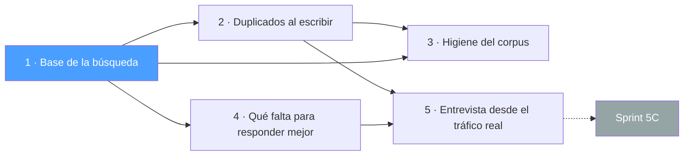

# Sprint 5B — Conocimiento Confiable 🧠

El 5A dejó el corpus **editable**; este sprint lo deja **confiable**: que lo que hay
adentro no se estorbe a sí mismo, que la búsqueda separe lo relevante del ruido, y que
el supervisor sepa qué le falta cargar en vez de mirar un porcentaje sin acción detrás.

Plan: [`docs/plan_de_trabajo.md`](../../docs/plan_de_trabajo.md) §Sprint 5B (tareas 5B.1–5B.14).

## El corte

| # | Pre-spec | Tareas | Depende de | Estado |
|---|---|---|---|---|
| 1 | [Base de la búsqueda](1-base-de-la-busqueda.md) | 5B.1–5B.3 | — | sin spec |
| 2 | [Duplicados al escribir](2-duplicados-al-escribir.md) | 5B.4–5B.5 | 1 | sin spec |
| 3 | [Higiene del corpus](3-higiene-del-corpus.md) | 5B.6–5B.8 | 1, 2 | sin spec |
| 4 | [Qué falta para responder mejor](4-que-falta-para-responder-mejor.md) | 5B.9–5B.10 | 1 | sin spec |
| 5 | [Entrevista desde el tráfico real](5-entrevista-desde-el-trafico-real.md) | 5B.11–5B.13 | 2, 4 | sin spec |

## Por qué ese orden

- **La 1 va primero de todo.** Cambiar los embeddings mueve todos los scores: lo que se
  mida antes queda invalidado, y el umbral de 0.65 puede dejar de ser el corte correcto.
- **La 2 antes que la 3** aunque sea mucho más chica: la 2 ataca la **causa** (el
  sistema fabrica duplicados por diseño) y la 3 el **síntoma**. Al revés, la limpieza
  corre contra un corpus que se sigue ensuciando solo.
- **La 5 al final** porque consume a la 4 (de ahí salen sus preguntas) y a la 2 (es un
  cuarto camino de ingesta y tiene que pasar por el mismo aviso).
- **La 3 y la 4 son independientes entre sí**: si hubiera que paralelizar algo, es ahí.

## Dos cosas para no perder de vista

1. **La higiene (pre-spec 3) rompe la convención del panel como banco de pruebas.**
   Una propuesta de fusión que no se lee comparativamente se aprueba a ciegas, y ahí el
   Principio III pasa de garantía a trámite. Está desarrollado en la pre-spec; conviene
   decidirlo al especificar, no al final.
2. **El cambio de embeddings de la pre-spec 1 se valida a mano.** El banco de escenarios
   que lo detectaría es del [Sprint 5C](../5C-capacitacion-audio-medicion/) y todavía no
   existe. Conviene registrar qué se probó y con qué resultado: es la línea de base que
   el 5C va a usar.
